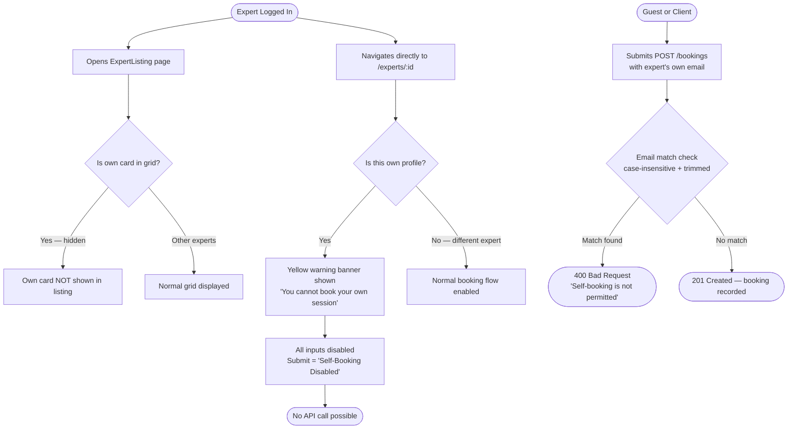
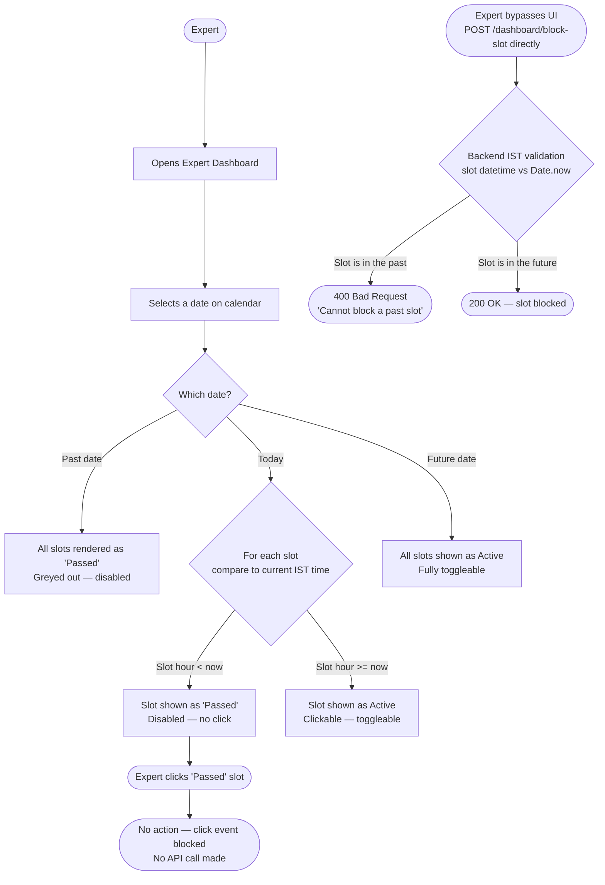
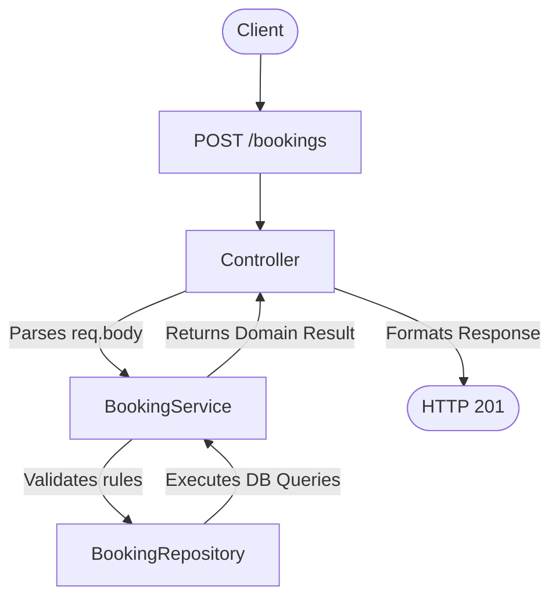
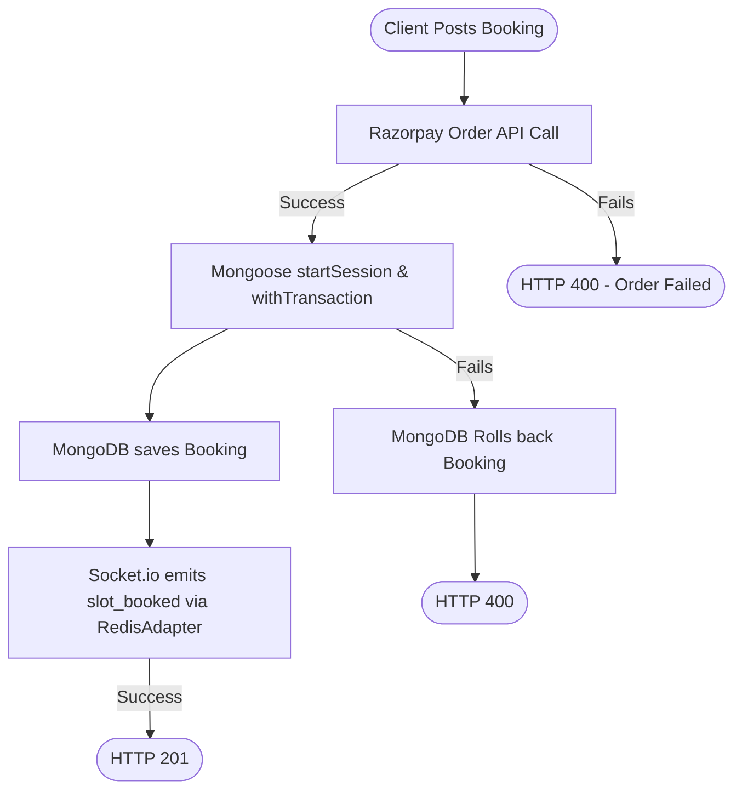

# Master Feature Requirement Specification

> Single source of truth for all feature requirements across all projects.
> Managed by the `feature-requirement-spec` skill. Do not split into separate files.
> Do not create a second requirements document — extend this one.

---

## Problem Statement

As software teams and AI agents work across multiple projects, feature requirements are
frequently re-specified from scratch for each new project — even when the feature (e.g.,
authentication, booking, rating systems) has been built before. This creates three
compounding problems:

1. **Redundancy**: Teams spend time writing requirements that already exist elsewhere,
   leading to duplicated effort and inconsistent standards across projects.

2. **Drift**: When two separate agents or team members independently define the same
   feature, their specs diverge in structure, depth, and quality. Neither is authoritative.

3. **Instability**: Without a persistent, evolving requirement record, bugs and edge cases
   discovered in one project are not captured for future projects — causing the same
   crashes and failures to recur.

This project (SkillSync) experienced this directly: two agents independently created
`MASTER_SPEC.md` and `docs/STANDARD_FEATURE_CATALOG.md` for the same purpose, with neither
document being complete on its own. This document resolves that by being the single,
authoritative, growing spec going forward.

---

## Purpose

`MASTER_SPEC.md` is the **single source of truth** for all feature requirement
specifications across all projects. It is:

- **Project-agnostic**: Not tied to any one project. It travels with the team and agents
  across projects, carrying accumulated feature knowledge forward.
- **Persistent and growing**: Each new project contributes new feature specs. Existing
  specs evolve based on implementation learnings. The document is never recreated from scratch.
- **Dual-audience**: Written to be read and acted upon by both humans (developers,
  architects, PMs) and AI agents (Claude Code CLI, Gemini CLI, Codex CLI, Claude, GPT-4, Gemini).
- **Implementation gate**: No feature may be coded until its spec section in this document
  is finalized. The spec is the contract; the code is the delivery.

---

## Goals / Objectives

| # | Goal | Success Condition |
|---|---|---|
| G1 | Eliminate redundant spec creation | No team member or agent writes a requirement for a feature already documented here |
| G2 | Ensure consistent quality standards | Every feature section passes the 15-block Definition of Complete checklist |
| G3 | Enable reliable feature replication | Any agent can pick up a Generic Blueprint section and implement it correctly in a new project without additional context |
| G4 | Prevent commercial crashes from unknown bugs | Every known bug and stability risk is captured in the relevant feature section, tagged MUST HAVE, before any other work continues |
| G5 | Support AI agent autonomy | An agent reading this document alone can determine: what to build, how to verify it, what is out of scope, and what depends on what — without asking clarifying questions |
| G6 | Preserve institutional knowledge | Decisions, bug histories, and requirement evolutions are logged in each feature's Spec Change Log, surviving team and agent turnover |

---

## How to Use This Document

- **Before implementing any feature**: find or create its section here
- **During implementation**: update the section if requirements change or gaps are found
- **After implementation**: mark status as `Complete` and record what was actually built
- **For bugs or crashes**: add to the relevant feature's `Known Bugs / Stability Risks`
  section, tagged `MUST HAVE`, before any other work continues
- **For a new project**: carry this file forward, update `active-project` in front matter,
  identify relevant Generic Blueprints, clone and adapt them

---

## Glossary

Canonical definitions of all domain terms used across this document.
AI agents must use these definitions — do not substitute synonyms or infer meanings.

| Term | Definition |
|---|---|
| **Feature** | A distinct, user-visible capability that solves a specific user problem, delivers measurable business value, and requires 1–3 months to implement. Expressible as `<action> <result> <object>`. |
| **Functionality** | A basic, atomic capability of the system (e.g., password hashing). Often an implementation detail that forms a building block of a Feature. |
| **Feature Cluster (Epic / Capability)** | A group of related features that together provide a larger business solution, taking multiple release cycles or quarters to complete. |
| **User Story** | A small, actionable slice of a feature, sized to be delivered by a single team in 1–2 weeks. |
| **Expert** | A registered service provider in the system. Not a general English adjective. |
| **Client** | A user who books sessions with Experts. Not a network client or HTTP client. |
| **Slot** | A single bookable time unit (1 hour) within a day's availability grid (e.g., "14:00"). |
| **Blocked Slot** | A slot marked unavailable by the Expert themselves. Not the same as a cancelled booking. |
| **Session** | A confirmed booking between a Client and an Expert for a specific Slot on a specific date. |
| **isRated** | Boolean flag on the Booking document. `true` means a review has already been submitted for this booking. |
| **IST** | Indian Standard Time, UTC+5:30. The canonical timezone for all time comparisons in this project. Constant year-round (no DST). |
| **Generic Blueprint** | A feature spec not tied to any single project. Reusable across projects. Status is `Generic Blueprint`. |
| **MoSCoW** | Priority tagging system: Must Have / Should Have / May Have / Could Have / Can Have. See `references/tagging-guide.md`. |
| **Spec Change Log** | Append-only timestamped history of changes made to a feature's spec section. |
| **Definition of Complete** | The 15-block checklist that must pass before a feature section is considered finalized. |
| **Implementation Gate** | The rule that no feature may be coded until its spec section is finalized and passes the Definition of Complete. |

---

## Requirement Quality Standards

### SMART Criteria

Every requirement must be:

- **Specific**: Clear, unambiguous, focused on a single function or goal.
- **Measurable**: Verifiable through automated tests or explicit manual checks.
- **Achievable**: Technically feasible within the current system architecture.
- **Relevant**: Directly supports the user role, business logic, or system security.
- **Time-bound**: Deliverable within a bounded scope (sprint, release, or project).

### Definition of Complete

A feature section is only **finalized** — and implementation may only begin — when ALL
of the following blocks are present and non-empty:

```
✓ Overview
✓ Functional Requirements       (MoSCoW tag + Rationale on every item)
✓ Non-Functional Requirements   (MoSCoW tag + Rationale on every item)
✓ User Interaction Flow         (at least 1 success path + 1 failure path)
✓ API Specifications            (auth scope on every endpoint)
✓ Edge Cases                    (at least 1 item, or explicit "None identified")
✓ Best Practices
✓ Acceptance Criteria           (minimum 2 numbered AC items)
✓ Non-Goals                     (at least 1 item)
✓ Dependencies                  (specific features/services, or "None")
✓ Testing Strategy              (unit + integration + manual)
✓ Known Bugs / Stability Risks  (populated or explicit "None identified.")
✓ Spec Change Log               (at least 1 entry with date)
✓ Status
✓ Last Updated
```

A partially filled section is `Draft` regardless of the Status field value.

---

## Index

| Feature | Status | Project | Last Updated |
|---|---|---|---|
| [Prevent Expert Self-Booking](#feature-prevent-expert-self-booking) | `Complete` | SkillSync | 2026-05-26 |
| [Disable Availability Toggling for Past Slots](#feature-disable-availability-toggling-for-past-slots) | `Complete` | SkillSync | 2026-05-26 |
| [Enforce Session Completion Time-Lock](#feature-enforce-session-completion-time-lock) | `Complete` | SkillSync | 2026-05-26 |
| [Simplified Phone Input UX](#feature-simplified-phone-input-ux) | `Complete` | SkillSync | 2026-05-26 |
| [12-Hour Format Conversion](#feature-12-hour-format-conversion) | `Complete` | SkillSync | 2026-05-26 |
| [Post-Session Rating & Review System](#feature-post-session-rating--review-system) | `Complete` | SkillSync | 2026-05-26 |
| [User Authentication & RBAC](#feature-user-authentication--rbac) | `Complete` | SkillSync | 2026-05-29 |
| [Real-Time Booking & Scheduling Engine](#feature-real-time-booking--scheduling-engine) | `Complete` | SkillSync | 2026-05-29 |
| [Dynamic Availability Management (Slot Toggling)](#feature-dynamic-availability-management-slot-toggling) | `Complete` | SkillSync | 2026-05-29 |
| [Internationalization & Localization Engine](#feature-internationalization--localization-engine) | `Complete` | SkillSync | 2026-05-29 |
| [Media & Gallery Upload System](#feature-media--gallery-upload-system) | `Complete` | SkillSync | 2026-05-27 |
| [Systemic Database Consistency Architecture](#feature-systemic-database-consistency-architecture) | `Complete` | SkillSync | 2026-05-26 |
| [Availability Schema Migration](#feature-availability-schema-migration) | `Complete` | SkillSync | 2026-05-26 |
| [Late Cancellation & Penalty Cooldown](#feature-late-cancellation--penalty-cooldown) | `Complete` | SkillSync | 2026-05-27 |
| [Two-Sided P2P Feedback System](#feature-two-sided-p2p-feedback-system) | `Complete` | SkillSync | 2026-05-27 |
| [Expert Business Analytics Dashboard](#feature-expert-business-analytics-dashboard) | `Complete` | SkillSync | 2026-05-27 |
| [Admin Dashboard Search & Filtering](#feature-admin-dashboard-search--filtering) | `Complete` | SkillSync | 2026-05-29 |
| [Automated Email & SMS Reminders](#feature-automated-email--sms-reminders) | `Complete` | SkillSync | 2026-05-28 |
| [Password Recovery & Auto-Login](#feature-password-recovery--auto-login) | `Complete` | SkillSync | 2026-05-29 |
| [Chat Messaging and Notifications](#feature-chat-messaging-and-notifications) | `Complete` | SkillSync | 2026-05-29 |
| [Razorpay Payment Gateway](#feature-razorpay-payment-gateway) | `Complete` | SkillSync | 2026-05-31 |
| [System Hardening (Webhook Idempotency & Job Recovery)](#feature-system-hardening-webhook-idempotency--job-recovery) | `Complete` | SkillSync | 2026-06-12 |
| [API Security Boundaries & Validation](#feature-api-security-boundaries--validation) | `Complete` | SkillSync | 2026-06-13 |
| [3-Tier Backend Architecture & Services Extraction](#feature-3-tier-backend-architecture--services-extraction) | `Complete` | SkillSync | 2026-06-14 |
| [Distributed State & Database Concurrency](#feature-distributed-state--database-concurrency) | `Complete` | SkillSync | 2026-06-14 |
| [Process Resilience & System Reliability](#feature-process-resilience--system-reliability) | `Complete` | SkillSync | 2026-06-14 |

---

## Feature: Prevent Expert Self-Booking

### Overview

Restricts booking privileges exclusively to the `'Client'` role, thereby preventing registered Experts and Administrators from scheduling expert sessions, protecting scheduling loop vulnerabilities, and ensuring clean role-based boundaries.

### Functional Requirements

- [MUST HAVE] Backend API must restrict booking creation strictly to authenticated users with the `'Client'` role (returning `403 Forbidden` with an explanation for Admins or Experts).
  Rationale: Server-side validation safeguard is non-negotiable for system data integrity and strict RBAC.

- [MUST HAVE] Backend API must reject booking POST submissions where the customer email
  matches the expert's credential email (case-insensitive, whitespace-trimmed).
  Rationale: Prevents unauthenticated guests or manual API requests from self-booking via email matching.

- [MUST HAVE] Frontend must hide the logged-in expert's card from the public explore
  directory grid page.
  Rationale: Simplifies UX by preventing experts from finding their own page in normal flows.

- [MUST HAVE] Frontend must display a prominent yellow warning banner if an expert accesses
  their own detail profile page directly.
  Rationale: Notifies the expert that they are on their own page and explains that self-booking is disabled.

- [MUST HAVE] Frontend must disable all booking interactive elements on any expert's
  profile page for logged-in Experts and Admins (date picker, slot selector, guest input fields, and submission button).
  Rationale: Deactivates the booking workflow locally for all non-client accounts.

- [MUST HAVE] Backend booking fetch API (`getBookingsByEmail`) must filter out and exclude slots with the notes 'Blocked by Expert'.
  Rationale: Keeps the client-facing booking history clean and prevents experts from seeing self-bookings/blocked slots.

- [SHOULD HAVE] Submit button text must change to "Self-Booking Disabled" when the page
  belongs to the logged-in user, "Booking Disabled for Experts" for other experts, and "Booking Disabled for Admins" for admins.
  Rationale: Offers clear, immediate visual confirmation of the deactivated state based on user role.

- [MUST HAVE] Frontend must hide the "My History" page link in the Navbar for logged-in Expert and Admin accounts, and the `/my-bookings` route must be protected to redirect non-Client accounts to `/`.
  Rationale: Prevents system administration or expert accounts from accessing client history pages.

- [MUST HAVE] Backend API must reject booking POST submissions initiated by users with the `'Admin'` role.
  Rationale: Prevents system administration accounts from contaminating booking lists and charts.

### Non-Functional Requirements

- [MUST HAVE] Email comparisons must be case-insensitive and whitespace-trimmed.
  Rationale: Prevents self-booking bypass through casing (e.g. `Sarah@test.com` vs
  `sarah@test.com`) or leading/trailing spaces.

- [MUST HAVE] The `isOwnProfile` computation on the frontend must be reactive — it must
  update instantly when authentication state changes (e.g., login while on the profile page).
  Rationale: Prevents a window where booking is briefly available before the disabled state is applied.

### User Interaction Flow



### API Specifications

* `POST /bookings`
  Input: `{ expertId, date, slot, userName, userEmail, userPhone }`
  Validation:
    - Populate `expert.user` reference
    - If `req.user` is defined and `req.user.role !== 'Client'` → 403 Forbidden
    - If `req.user._id === expert.user._id` → 400 Bad Request
    - If `userEmail.toLowerCase().trim() === expert.user.email.toLowerCase().trim()` → 400 Bad Request
  Output: `{ booking }` on success
  Auth: Optional (guest or authenticated Client)

### Edge Cases

- When an expert accesses their own profile while logged out, the page behaves normally.
  As soon as they log in, the page must dynamically compute `isOwnProfile` / `isExpert` / `isAdmin` and apply all
  disabled states instantly without a page reload.
- When an expert registers a guest booking with a different name but their own email, the
  backend must block it based on email validation alone.

### Best Practices

* Use the authenticated context (`useAuth`) to dynamically fetch the client `user` credentials.
* Populate the `user` reference on the `Expert` model during backend booking validation
  to perform accurate object ID and email checks.
* Compute `isOwnProfile` in a `useMemo` or `useEffect` that re-runs when `user` changes.

### Acceptance Criteria

* **AC 1.1:** `POST /bookings` with `userEmail` matching the expert's registered email
  (case-insensitive) must return `400 Bad Request` with a message indicating self-booking
  is not permitted.
* **AC 1.2:** An authenticated Expert accessing their own ExpertDetail page must see all
  booking inputs in a disabled state and the submit button displaying "Self-Booking Disabled".
* **AC 1.3:** The ExpertListing page rendered for a logged-in Expert must not display that
  Expert's own card in the grid.
* **AC 1.4:** `GET /bookings` querying by the expert's email must not return any booking objects where `notes === 'Blocked by Expert'` (blocked slots).
* **AC 1.5:** An authenticated Admin accessing any ExpertDetail profile page must see all booking inputs in a disabled state, and the submit button displaying "Booking Disabled for Admins".
* **AC 1.6:** `POST /bookings` from a logged-in user with the `'Admin'` or `'Expert'` role must return `403 Forbidden` with an appropriate error message indicating that scheduling is restricted to Client accounts.
* **AC 1.7:** Access to `/my-bookings` must be strictly restricted to the `'Client'` role; other roles attempting to access it are redirected to `/`.

### Non-Goals

- Does not restrict an Expert from viewing their own profile page — only from booking.
- Does not permit Experts from booking sessions with other experts.
- Does not restrict Admin users from viewing or managing bookings globally — only from creating bookings.

### Dependencies

- Feature: User Authentication & RBAC — Expert identity (`userId` + `email`) must be
  available via authenticated context (`useAuth`) for frontend checks.
- Service: MongoDB Expert model — must populate the `user` reference to enable backend
  email/ID comparison.

### Testing Strategy

- Unit: Test email comparison utility for case-insensitive, trimmed matching
  (e.g., `"  Sarah@test.com"` should match `"sarah@test.com"`).
- Integration: `POST /bookings` with matching email → assert 400;
  with different email → assert 201.
- Manual: Log in as an Expert, navigate to own profile, verify all inputs are disabled
  and the yellow banner is visible.

### Known Bugs / Stability Risks

- [MUST HAVE - Resolved 2026-05-26] Experts saw their own blocked slots (placeholder bookings) in their own "My History" client-facing page, making it look like they booked a session with themselves. Resolved by filtering out bookings with notes 'Blocked by Expert' in the backend `getBookingsByEmail` controller.

### Spec Change Log

| Date | Author | Summary |
|---|---|---|
| 2026-05-25 | Agent | Initial implementation. Backend email + ID check added. Frontend card hidden and profile disabled. |
| 2026-05-26 | Agent | Spec enriched to 15-block structure: flow, API spec, ACs, non-goals, dependencies, testing strategy, spec change log added. |
| 2026-05-26 | Agent | Updated spec to exclude 'Blocked by Expert' slots from the client-facing booking history listing. |
| 2026-05-26 | Agent | Integrated Admin role isolation: disabled booking inputs on frontend and blocked Admin bookings on backend. |

### Status
`Complete`

### Last Updated
2026-05-26

---

## Feature: Disable Availability Toggling for Past Slots

### Overview

Restricts experts from blocking or unblocking availability slots that fall in the past
relative to the current local IST clock (UTC+5:30).

### Functional Requirements

- [MUST HAVE] Backend `blockSlot` controller must reject block requests for date/time
  slots that have already passed in IST.
  Rationale: Prevents database clutter from historical slot blocking.

- [MUST HAVE] Frontend grid must grey out and display as `"Passed"` any slots on the
  selected date that have already passed.
  Rationale: Informs the expert which time segments are no longer toggleable.

- [MUST HAVE] Frontend must disable click events and toggle interactions for slots
  that are in the past.
  Rationale: Prevents redundant API requests for historical slots.

- [SHOULD HAVE] Already blocked slots in the past must display as `"Blocked (Passed)"`
  and be disabled.
  Rationale: Ensures the expert has clean visibility over past blocks without allowing edit access.

- [COULD HAVE] A visual timestamp showing when a past slot was blocked, for audit purposes.

### Non-Functional Requirements

- [MUST HAVE] Calculations for past status must reliably convert selected date/time slots
  using Asia/Kolkata (IST) timezone offset UTC+5:30.
  Rationale: Prevents server/client clock drift and offset issues from incorrectly
  disabling active slots.

### User Interaction Flow



### API Specifications

* `POST /expert-dashboard/block-slot`
  Input: `{ expertId, date, slot }`
  Validation: If `slot datetime (IST, UTC+5:30) < Date.now()` → 400 Bad Request
  Output: `{ message: "Slot blocked" }` on success
  Auth: Expert role required

* `POST /expert-dashboard/unblock-slot`
  Input: `{ expertId, date, slot }`
  Validation: If `slot datetime (IST, UTC+5:30) < Date.now()` → 400 Bad Request
  Output: `{ message: "Slot unblocked" }` on success
  Auth: Expert role required

### Edge Cases

- When selected date is today, only the hourly slots prior to the current IST time are
  marked as "Passed". Future hourly slots on the same day remain fully toggleable.
- When selected date is in the past (e.g. yesterday), all slots in the grid must be
  disabled and marked as "Passed".

### Best Practices

* Use an `isSlotInPast(date, slot)` helper utility using the standard Asia/Kolkata
  timezone offset boundary comparisons on both the frontend and backend.
* This same utility is shared with the Session Completion Time-Lock feature — keep it
  in a shared utility module.

### Acceptance Criteria

* **AC 2.1:** `POST /expert-dashboard/block-slot` for a slot dated yesterday must return
  `400 Bad Request`.
* **AC 2.2:** Expert Dashboard displaying today's date must render all hourly slots prior
  to the current IST clock time as disabled with a "Passed" label, and all future slots
  as active and clickable.
* **AC 2.3:** Clicking a "Passed" slot in the UI must trigger no API call and no visual
  state change.

### Non-Goals

- Does not retroactively unbook confirmed client bookings that have passed.
- Does not prevent Experts from viewing historical slot data — only from modifying it.
- Does not apply timezone logic for any timezone other than IST (UTC+5:30).

### Dependencies

- Feature: Enforce Session Completion Time-Lock — shares the `isSlotInPast()` IST
  timezone calculation utility.
- Service: MongoDB Booking model — blocked slots are stored as Booking documents with
  a designated "Blocked" note, reusing the existing unique index.

### Testing Strategy

- Unit: Test `isSlotInPast(date, slot)` with a slot 1 hour in the past → returns `true`;
  1 hour in future → returns `false`; exact current minute boundary.
- Integration: `POST /dashboard/block-slot` for yesterday → assert 400;
  for tomorrow → assert 200.
- Manual: Open Expert Dashboard, select today's date, verify slots before the current
  hour show "Passed" and are not clickable.

### Known Bugs / Stability Risks

None identified.

### Spec Change Log

| Date | Author | Summary |
|---|---|---|
| 2026-05-25 | Agent | Initial implementation. Backend IST validation and frontend grid disabling added. |
| 2026-05-26 | Agent | Spec enriched to 15-block structure: flow, API spec, ACs, non-goals, dependencies, testing strategy added. |
| 2026-05-26 | Agent | Standardized past-slot calculation helper `isSlotInPast` across frontend and backend using absolute UTC offset epoch comparison. |

### Status
`Complete`

### Last Updated
2026-05-26

---

## Feature: Enforce Session Completion Time-Lock

### Overview

Time-locks session completion, preventing clients or experts from marking a confirmed
session as Completed before its scheduled start time.

### Functional Requirements

- [MUST HAVE] Backend `updateBookingStatus` API must reject `Completed` status changes
  if the current time is before the scheduled session start time.
  Rationale: Ensures transaction logic consistency and prevents fraudulent review submissions.

- [MUST HAVE] Frontend MyBookings page must disable the "Mark as Completed" button for
  client bookings until the session start time has arrived.
  Rationale: Prevents users from attempting invalid status updates.

- [MUST HAVE] Frontend Expert Dashboard sessions table must disable the "Complete" button,
  rendering it as a disabled "Locked" status button, for upcoming sessions.
  Rationale: Ensures the time-lock rule is enforced consistently on the provider-facing portal.

- [SHOULD HAVE] The backend rejection response must include the exact current time and
  the scheduled session time in the error message.
  Rationale: Provides transparent debugging information for developers and support staff.

- [CAN HAVE] Automatic status transition to "Completed" when the session time passes,
  without requiring manual trigger.
  Rationale: Reduces manual overhead for high-volume platforms.

### Non-Functional Requirements

- [MUST HAVE] Validation checks must run using absolute Unix millisecond comparison
  with explicit IST offset (+05:30) appended to the session date/time string.
  Rationale: String-based date parsing fails inconsistently across environments.
  Absolute millisecond comparison is environment-independent and fail-proof.

### User Interaction Flow

```
[Client] -> Opens My Bookings page -> [System evaluates Booking status]
  |-- Confirmed or Pending --> Rate and Review button NOT shown
  |-- Completed --> System checks isRated flag
        |-- isRated == true --> Rate and Review button hidden
        |-- isRated == false --> Rate and Review button visible
```

### API Specifications

* `PATCH /bookings/:id/status`
  Input: `{ status: "Completed" }`
  Validation:
    - Parse: `new Date(booking.date + "T" + booking.slot + ":00+05:30").getTime()`
    - Compare: `sessionStartMs > Date.now()` → 400 Bad Request
    - Response body must include `sessionTime` and `currentTime` fields
  Output: `{ booking }` on success
  Auth: Client or Expert role required

### Edge Cases

- When a session date has arrived but the exact hourly slot has not, the status action
  remains locked. The complete trigger must unlock exactly at the start hour (e.g., a
  14:00 session unlocks at 14:00:00 IST, not 13:59).
- When the client's local clock is in a different timezone, the backend IST-based check
  is always authoritative. The client clock is irrelevant.

### Best Practices

* Rely on the server's authoritative clock (`Date.now()`) compared to the session
  timestamp parsed with offset `+05:30` to enforce timezone-safe constraints.
* Avoid string comparisons and manual UTC arithmetic — both have produced bugs in this
  project (see Known Bugs).
* Use numeric (millisecond) comparison as the definitive industry standard.

### Acceptance Criteria

* **AC 3.1:** `PATCH /bookings/:id/status` with `{ status: "Completed" }` for a
  session scheduled 1 hour in the future must return `400 Bad Request` with a timestamped
  error body containing `sessionTime` and `currentTime`.
* **AC 3.2:** The "Mark as Completed" button on the MyBookings page must be invisible or
  disabled for any booking whose scheduled slot has not yet arrived.
* **AC 3.3:** The "Complete" button on the Expert Dashboard must render as a disabled
  "Locked" state button for all upcoming sessions.
* **AC 3.4:** `PATCH` with `status: "Completed"` for a session whose scheduled time has
  passed must return `200 OK` and update the booking status in the database.

### Non-Goals

- Does not prevent status changes to "Cancelled" regardless of session time.
- Does not automatically mark sessions as "Completed" when the time passes — manual
  trigger is required.
- Does not apply time-lock to "Confirmed" or "Pending" status transitions.

### Dependencies

- Feature: Disable Availability Toggling for Past Slots — shares the IST timezone
  calculation approach (UTC+5:30 offset appended to date strings).
- Feature: Post-Session Rating & Review System — rating submission is only permitted
  after status reaches "Completed"; the time-lock is a prerequisite gating mechanism.

### Testing Strategy

- Unit: Test time-lock comparison: build IST moment from `date + "T" + slot + ":00+05:30"`,
  compare to `Date.now()`. Assert past session returns false (unlock); future returns true (lock).
- Integration: `PATCH /bookings/:id/status` for a future session → assert 400 with
  timestamped body; for a past session → assert 200 + status updated.
- Manual: Book a session for the current hour, wait for the slot to arrive, verify the
  button unlocks on both MyBookings and Expert Dashboard at the correct IST time.

### Known Bugs / Stability Risks

- [MUST HAVE - Resolved 2026-05-10] Time comparison using browser string parsing failed
  in some environments due to locale differences.
  Root cause: Appending "+05:30" to date strings behaved inconsistently across Node.js
  versions and browser JS engines.
  Fix: Replaced with absolute Unix millisecond comparison by manually computing the IST
  offset in integer arithmetic. This is now the definitive approach.

- [MUST HAVE - Resolved 2026-05-10] Second iteration: ISO 8601 moments with explicit
  "+05:30" suffix introduced. Eliminated manual UTC arithmetic which was error-prone.
  Root cause: Manual arithmetic `hours * 3600000 + minutes * 60000` miscalculated
  at day boundaries.
  Fix: Use `new Date(dateString + "T" + slot + ":00+05:30").getTime()` directly.

- [MUST HAVE - Resolved 2026-05-10] Third iteration: Added real-time debug console
  logging. Backend error responses now include exact system time and session time.
  Lesson: Time-lock logic must use numeric (millisecond) comparisons only. String-based
  date parsing must never be used for time-lock boundary checks.

### Spec Change Log

| Date | Author | Summary |
|---|---|---|
| 2026-05-10 | Agent | Initial implementation. Time-lock added to backend PATCH and frontend MyBookings. |
| 2026-05-10 | Agent | Bug fix iteration 1: replaced string parsing with absolute millisecond comparison. |
| 2026-05-10 | Agent | Bug fix iteration 2: switched to ISO 8601 with +05:30 suffix. |
| 2026-05-10 | Agent | Bug fix iteration 3: added debug logging + timestamped backend error responses. |
| 2026-05-25 | Agent | Extended to Expert Dashboard: "Complete" button shows as "Locked" for future sessions. |
| 2026-05-26 | Agent | Spec enriched to 15-block structure: all missing blocks added. Known Bugs documented from log.md. |
| 2026-05-26 | Agent | Standardized past-session calculation helper `isSessionPast` across MyBookings and Expert Dashboard using absolute UTC offset epoch comparison. |

### Status
`Complete`

### Last Updated
2026-05-26

---

## Feature: Simplified Phone Input UX

### Overview

Simplifies phone input forms across the platform by accepting standard 10-digit entries
from users and handling the required country prefix (+91) transparently.

### Functional Requirements

- [MUST HAVE] Frontend must allow registration, profile, and booking forms to accept
  standard 10-digit mobile numbers without requiring users to type `+91`.
  Rationale: Streamlines input fields and reduces form friction for Indian users.

- [MUST HAVE] Frontend must prepend `+91` to the 10-digit input before sending the
  API request.
  Rationale: Maintains strict backend Mongoose schema compliance which mandates the `+91` prefix.

- [MUST HAVE] Frontend must strip `+91` from retrieved user profile data before
  displaying it in form input values.
  Rationale: Ensures input fields show clean local numbers for easier editing.

- [SHOULD HAVE] Frontend must validate that the entered number is exactly 10 digits
  (digits only, no spaces or dashes) before submission.
  Rationale: Prevents invalid formats reaching the backend.

- [COULD HAVE] Display a subtle `+91` prefix indicator as non-editable text beside
  the input field to clarify the country code context.

### Non-Functional Requirements

- [MUST HAVE] Phone normalization must be performed client-side before every API call
  that includes a phone field.
  Rationale: Consistent normalization prevents schema validation failures across all forms.

### User Interaction Flow

```
[User] -> Submits 10-digit phone number -> [Frontend normalizePhone]
  |-- Success --> Prepends '+91' -> API receives E.164 format
  |-- Failure --> Validation error shown, form not submitted
[User] -> Opens Edit Profile -> [API returns phone]
  |-- Success --> Frontend strips '+91' -> Displays clean 10 digits
```

### API Specifications

* `POST /auth/register`
  Input: `{ name, email, password, phone: "+91XXXXXXXXXX" }` (frontend prepends `+91`)
  Validation: Mongoose regex `^\+91[0-9]{10}$`
  Auth: Public

* `POST /bookings`
  Input: `{ ..., userPhone: "+91XXXXXXXXXX" }`
  Validation: Mongoose regex `^\+91[0-9]{10}$`
  Auth: Optional

* `GET /auth/me`
  Output: `{ user: { phone: "+91XXXXXXXXXX", ... } }`
  Frontend: strips `+91` before rendering in input
  Auth: Bearer JWT required

### Edge Cases

- If a user pastes "+91XXXXXXXXXX" directly into the field, the frontend should detect
  the prefix and strip it before display, then re-prepend on submission — avoiding double-prefixing.
- If the stored phone is in a legacy format without the prefix, the strip operation should
  gracefully handle the absence of "+91" without breaking the display.

### Best Practices

* Create a single `normalizePhone(input)` utility: strips non-digits, strips leading `91`
  or `+91` if present, then prepends `+91`.
* Create a single `displayPhone(stored)` utility: strips `+91` prefix for display.
* Import these utilities in every form component — never inline the logic.

### Acceptance Criteria

* **AC 4.1:** Submitting a registration form with a 10-digit phone number (no prefix)
  must result in the database storing `+91XXXXXXXXXX` format.
* **AC 4.2:** Loading a user profile in edit mode must display the phone field as 10
  digits with no `+91` prefix visible in the input.
* **AC 4.3:** Submitting a form with a phone number that is not exactly 10 digits must
  return a `400 Bad Request` validation error.

### Non-Goals

- Does not validate whether the phone number is an active or reachable carrier number.
- Does not support international phone numbers other than Indian (+91) format.
- Does not apply phone masking or formatting (e.g., XXX-XXX-XXXX) in the input field.

### Dependencies

- Feature: Internationalization & Localization Engine — the phone normalization rule
  is an instance of the broader localization standard defined there.
- Service: Mongoose User model — enforces the `+91` regex constraint at schema level.

### Testing Strategy

- Unit: Test `normalizePhone`: input `"9876543210"` → `"+919876543210"`;
  input `"+919876543210"` → `"+919876543210"` (idempotent);
  input `"  9876 543 210"` → `"+919876543210"`.
  Test `displayPhone`: input `"+919876543210"` → `"9876543210"`.
- Integration: `POST /auth/register` with phone `"9876543210"` (after frontend normalization)
  → assert DB stores `"+919876543210"`.
- Manual: Open registration form, type 10 digits, submit, open profile — verify field shows
  10 digits only.

### Known Bugs / Stability Risks

None identified.

### Spec Change Log

| Date | Author | Summary |
|---|---|---|
| 2026-05-25 | Agent | Initial implementation. Frontend normalization and Mongoose schema validation added. |
| 2026-05-26 | Agent | Spec enriched to 15-block structure: flow, API spec, ACs, non-goals, dependencies, testing strategy added. |

### Status
`Complete`

### Last Updated
2026-05-26

---

## Feature: 12-Hour Format Conversion

### Overview

Displays all session slot times in a clean, user-friendly 12-hour AM/PM format
(e.g., `02:00 PM` instead of `14:00`) across all user-facing surfaces.

### Functional Requirements

- [MUST HAVE] Expert Dashboard calendar scheduler, session listings, and notifications
  must format 24-hour database times into 12-hour AM/PM equivalents.
  Rationale: Implements user-friendly time standards expected by Indian users.

- [MUST HAVE] Booking slots displayed on the expert's detail booking page must render
  in 12-hour AM/PM format.
  Rationale: Standardizes customer-facing availability displays.

- [MUST HAVE] The database must continue storing time values in 24-hour format.
  Rationale: 12-hour format is display-only; changing storage format would break
  all existing IST timezone calculations that depend on 24-hour strings.

- [SHOULD HAVE] Any Socket.io real-time slot event notifications that render time to
  the user must also apply the 12-hour format.
  Rationale: Consistency across real-time and static views.

- [COULD HAVE] A user preference toggle to switch between 12-hour and 24-hour display.

### Non-Functional Requirements

- [MUST HAVE] The `formatTo12Hour` utility must correctly handle all 24 hours including
  midnight (00:00 → 12:00 AM) and noon (12:00 → 12:00 PM).
  Rationale: Midnight and noon are common edge cases that break naive modulo implementations.

### User Interaction Flow

```
[User] -> Opens Dashboard/Detail Page -> [System returns 24-hour time]
  |-- Render Time --> formatTo12Hour applied -> Displays 12-hour format
[Socket] -> Receives slot_booked event -> [System checks UI state]
  |-- Slot visible --> formatTo12Hour applied -> Displays 12-hour format
  |-- Slot hidden --> No action needed
```

### API Specifications

No new endpoints. This feature operates at the display layer only.
- Data stored in database: 24-hour format strings (e.g., `"14:00"`)
- Data in all API request/response payloads: 24-hour format (unchanged)
- Frontend applies `formatTo12Hour("14:00")` → `"02:00 PM"` at render time

### Edge Cases

- `"00:00"` must render as `"12:00 AM"` (midnight), not `"0:00 AM"`.
- `"12:00"` must render as `"12:00 PM"` (noon), not `"0:00 PM"`.
- `"23:00"` must render as `"11:00 PM"`.

### Best Practices

* Create a single `formatTo12Hour(timeString)` utility shared across all frontend components.
* Create a single `timeFormatters.js` utility for the backend.
* Never inline the conversion logic — a single utility prevents drift between surfaces.
* Do not convert to 12-hour format in general API response structures, but **DO** convert it when generating human-readable text payloads (e.g. notifications, emails, SMS).
* Raw 24-hour database time strings (`slotTime`) must never be passed directly into user-facing payload strings without passing through the central `timeFormatters.js` utility.

### Acceptance Criteria

* **AC 5.1:** All time slot buttons rendered on the ExpertDetail booking page must
  display in 12-hour AM/PM format (e.g., `"02:00 PM"`, not `"14:00"`).
* **AC 5.2:** The Expert Dashboard session table and availability grid must display
  times in 12-hour AM/PM format.
* **AC 5.3:** The database must continue to store time values in 24-hour format —
  verified by reading raw MongoDB documents.

### Non-Goals

- Does not change how time is stored in MongoDB — storage remains 24-hour format.
- Does not apply to API request or response payloads — only to UI rendering.
- Does not support locale-specific time formatting beyond 12-hour AM/PM.

### Dependencies

- Feature: Disable Availability Toggling for Past Slots — slot time strings in the grid
  are the same strings processed by the 12-hour formatter.
- Feature: Enforce Session Completion Time-Lock — session times displayed in time-lock
  UI elements use the 12-hour formatter.
- Feature: Internationalization & Localization Engine — the 12-hour format rule is
  an instance of the broader localization standard.

### Testing Strategy

- Unit: Test `formatTo12Hour` utility:
  `"00:00"` → `"12:00 AM"`, `"12:00"` → `"12:00 PM"`,
  `"13:00"` → `"01:00 PM"`, `"23:00"` → `"11:00 PM"`.
- Integration: No API impact — display-only transformation.
- Manual: Open ExpertDetail page and Expert Dashboard, verify all time values show
  AM/PM format across all components.

### Known Bugs / Stability Risks

None identified.

### Spec Change Log

| Date | Author | Summary |
|---|---|---|
| 2026-05-25 | Agent | Initial implementation. `formatTo12Hour` utility added to ExpertDetail and Expert Dashboard. |
| 2026-05-26 | Agent | Spec enriched to 15-block structure: flow, API spec, ACs, non-goals, dependencies, testing strategy added. |
| 2026-05-29 | Agent | Added backend standardization requirement. `timeFormatters.js` created and enforced for all notification/email text generation. |

### Status
`Complete`

### Last Updated
2026-05-29

---

## Feature: Post-Session Rating & Review System

### Overview

Allows clients to submit star ratings and optional written comments for completed sessions
to build marketplace credibility and provide quality feedback to experts.

### Functional Requirements

- [MUST HAVE] Ratings can only be submitted for sessions that have a database status
  of `Completed`.
  Rationale: Prevents reviews on unfulfilled or in-progress appointments.

- [MUST HAVE] Double rating prevention: once a booking's `isRated` flag is `true`, no
  further rating submissions can be accepted for that booking ID.
  Rationale: Enforces one review per session transaction to prevent manipulation.

- [MUST HAVE] Client review page must display an interactive star rating selector (1–5)
  and an optional feedback text area.
  Rationale: Captures both quantitative ratings and qualitative comments.

- [MUST HAVE] Successful submissions must write to the `Review` collection and
  dynamically update the expert's rolling `averageRating` and `numReviews` fields.
  Rationale: Automatically syncs aggregate metrics without manual recalculation.

- [SHOULD HAVE] The "Rate & Review" button must disappear after a successful submission,
  replaced by the submitted rating display.
  Rationale: Clear confirmation to the user that their review was recorded.

- [COULD HAVE] Review flagging / moderation queue for administrators.
  Rationale: Quality control for marketplace trust at scale.

- [CAN HAVE] Expert response to a client review.
  Rationale: Dialogue builds marketplace transparency; deferred to future scale.

### Non-Functional Requirements

- [MUST HAVE] The `averageRating` update must be atomic — the formula is:
  `((oldAvg * count) + newRating) / (count + 1)`.
  Rationale: Non-atomic updates under concurrent submissions would corrupt the aggregate.

- [MUST HAVE] The `isRated` flag on the Booking document must be set to `true` in the
  same operation as the Review document creation.
  Rationale: A partial write (review created but flag not set) would allow duplicate reviews.

### User Interaction Flow

```
[Client] -> Clicks Rate and Review -> [System validates POST /experts/:id/rate]
  |-- Valid --> Review created, booking.isRated set to true -> Success UI
  |-- Not Completed --> 400 Bad Request
  |-- Already Rated --> 400 Bad Request
```

### API Specifications

* `POST /experts/:id/rate`
  Input: `{ bookingId, rating (integer 1–5), comment (optional string) }`
  Validation:
    - Booking must exist and have status `Completed`
    - `booking.isRated` must be `false`
    - `rating` must be integer between 1 and 5
  Output: `{ averageRating, numReviews }`
  Side effects: `booking.isRated = true`; `expert.averageRating` and `expert.numReviews` updated
  Auth: Client role required

* `GET /experts/:id/reviews`
  Output: `[{ rating, comment, userName, createdAt }]`
  Auth: Public

### Edge Cases

- If two simultaneous rating requests arrive for the same booking, the first sets
  `isRated: true`; the second must receive 400 due to the `isRated` check.
- If the expert has zero reviews and receives the first rating, `averageRating` should
  equal the submitted rating exactly.

### Best Practices

* Use MongoDB's `findOneAndUpdate` with an atomic `$set` for `isRated` and a separate
  atomic update for `averageRating` — do not use two separate queries.
* Verify the booking belongs to the requesting client before allowing a rating submission.

### Acceptance Criteria

* **AC 6.1:** `POST /experts/:id/rate` for a booking with status `"Confirmed"`
  must return `400 Bad Request`.
* **AC 6.2:** `POST /experts/:id/rate` for a booking where `isRated` is `true`
  must return `400 Bad Request`.
* **AC 6.3:** Successful rating submission must update `expert.averageRating` using
  the formula: `((oldAvg * count) + newRating) / (count + 1)`.
* **AC 6.4:** The "Rate & Review" button must not appear on any booking not in
  `"Completed"` status.

### Non-Goals

- Does not support editing or deleting a submitted review.
- Does not include a review moderation or flagging queue (deferred — `CAN HAVE`).
- Does not display reviews on the ExpertListing grid — only on the ExpertDetail profile page.

### Dependencies

- Feature: Enforce Session Completion Time-Lock — sessions must be manually marked
  `Completed` (gated by time-lock) before rating becomes available.
- Service: MongoDB Review collection — stores review documents.
- Service: MongoDB Expert model — stores `averageRating` and `numReviews` aggregate fields.

### Testing Strategy

- Unit: Test `averageRating` formula: `((4.0 * 2) + 5) / 3 = 4.33`.
- Integration: `POST /experts/:id/rate` for a Completed booking → assert 201 +
  `averageRating` updated; repeat the same call → assert 400.
- Manual: Mark a booking as Completed, visit MyBookings, click "Rate & Review", submit
  a star rating, verify the button disappears and the expert profile page shows the
  updated average rating.

### Known Bugs / Stability Risks

- [MUST HAVE - Resolved 2026-06-14] "Missing mongoose dependency in ExpertService": Client rating submissions crashed the server because `mongoose.startSession()` was called inside `ExpertService.rateClient` without importing `mongoose`. Resolved by adding the `mongoose` require statement to the service.

### Spec Change Log

| Date | Author | Summary |
|---|---|---|
| 2026-05-25 | Agent | Initial implementation. Review model, rate endpoint, isRated flag, and averageRating calculation added. |
| 2026-05-26 | Agent | Spec enriched to 15-block structure. Merged with Generic Blueprint content from deprecated STANDARD_FEATURE_CATALOG.md. |
| 2026-06-14 | Antigravity AI | Logged and resolved missing `mongoose` dependency crash during rating submissions. |

### Status
`Complete`

### Last Updated
2026-06-14

---
---
<!-- GENERIC BLUEPRINTS — Reusable across projects. Clone and adapt for each new project. -->
---
---

## Feature: User Authentication & RBAC

### Overview

Provides secure user identity verification, session management, and role-based access
control for multi-tenant systems. Ensures only authorized roles can access protected resources.

### Functional Requirements

- [MUST HAVE] Password hashing using bcrypt (minimum 10 salt rounds) before storage.
  Rationale: Plain text storage is a critical security vulnerability; bcrypt is the
  industry standard for password hashing.

- [MUST HAVE] JWT token generation on login and register, signed with a secure environment
  secret (never hardcoded).
  Rationale: Stateless authentication that does not require server-side session storage.

- [MUST HAVE] Auth middleware that validates JWT on all non-public API routes.
  Rationale: Protects private data and operations from unauthorized access.

- [MUST HAVE] Role hierarchy enforcement on protected routes (e.g., Client, Expert, Admin).
  Rationale: Prevents privilege escalation between roles.

- [SHOULD HAVE] Automatic client-side redirect to login on `401 Unauthorized` API response.
  Rationale: Prevents users from seeing broken authenticated pages after session expiry.

- [MUST HAVE] Client-side app must verify and sync the logged-in user profile from the server on startup to update roles and detect account changes.
  Rationale: Prevents local storage role values from becoming stale if the user's role is updated or deleted on the database.

- [COULD HAVE] Token refresh mechanism to extend sessions without requiring re-login.

- [CAN HAVE] Multi-factor authentication (MFA) via SMS or TOTP app.

### Non-Functional Requirements

- [MUST HAVE] JWT secret must be stored in environment variables, never in source code.
  Rationale: Hardcoded secrets exposed in version control are a critical security risk.

- [MUST HAVE] Passwords must never appear in API responses or server-side logs.
  Rationale: Prevents credential leakage through logging pipelines.

### User Interaction Flow

```
[Visitor] -> Submits Auth Form -> [System validates payload]
  |-- Valid --> JWT generated, stored in localStorage -> Redirect to Dashboard
  |-- Invalid / Wrong Credentials --> Error shown -> Stays on page
[User] -> Accesses Protected Route -> [Auth Middleware checks JWT]
  |-- Valid JWT --> Request proceeds
  |-- Invalid JWT --> 401 Unauthorized -> Redirect to Login
```

### API Specifications

* `POST /auth/register`
  Input: `{ name, email, password, role }`
  Output: `{ token, user }` (no password field in response)
  Auth: Public

* `POST /auth/login`
  Input: `{ email, password }`
  Output: `{ token, user }`
  Auth: Public

* `GET /auth/profile`
  Output: `{ user }` (no password field)
  Auth: Bearer JWT required

### Edge Cases

- When a token expires mid-session, the next protected API call must return 401 and the
  client must redirect to login without losing user context where possible.
- When `role` is absent during registration, default to "Client".

### Best Practices

* Use a dedicated `protect` middleware that attaches decoded user to `req.user` for
  downstream controllers.
* Never return the hashed password in any API response — use `.select("-password")` on queries.
* Verify role with a separate `authorize(...roles)` middleware chained after `protect`.

### Acceptance Criteria

* **AC A.1:** `POST /auth/register` with valid payload must return `201` with a JWT
  and user object (password field must be absent from response).
* **AC A.2:** `GET /auth/profile` without Authorization header must return `401 Unauthorized`.
* **AC A.3:** `GET /auth/profile` with a Client-role token accessing an Admin-only route must
  return `403 Forbidden`.
* **AC A.4:** Passwords stored in MongoDB must match bcrypt format (never plain text).
* **AC A.5:** Client-side app must query the profile endpoint (`GET /auth/profile`) on initialization if a token is present, and update local storage and user context state with the fresh response.

### Non-Goals

- Does not include social / OAuth login (Google, GitHub) — `CAN HAVE`.
- Does not manage device sessions or concurrent login limits.
- Does not include password reset via email (deferred — `COULD HAVE`).

### Dependencies

- Service: `bcrypt` library — password hashing and comparison.
- Service: `jsonwebtoken` library — token generation and verification.
- Service: MongoDB User model — stores credentials and role.

### Testing Strategy

- Unit: Test bcrypt hash + compare; test JWT sign + verify with correct and incorrect secrets.
- Integration: `POST /auth/register` → assert 201 + JWT present; `POST /auth/login` with
  wrong password → assert 401; `GET /auth/profile` with valid token → assert 200 + user object.
- Manual: Register a new user, copy the JWT, use it in Postman/curl to access a
  protected endpoint, verify 200. Then use an expired/invalid token and verify 401.

### Known Bugs / Stability Risks

- [MUST HAVE - Resolved 2026-05-31] "Express 5.0 TypeError in NoSQL Sanitize Middleware": Global NoSQL sanitization mutated `req.query`, which is immutable in Express 5.0, causing server crashes and CORS preflight failures. Resolved by writing an Express 5.0-compatible wrapper.
- [MUST HAVE - Resolved 2026-05-29] "Hardcoded Fallback JWT Secrets": The application used a fallback string when JWT_SECRET was missing. Resolved by removing all fallback secrets and adding a synchronous startup validation crash when JWT_SECRET is unset.
- [MUST HAVE - Resolved 2026-05-29] "Brute-Force vulnerability on authentication endpoints": Endpoints had no rate limiting, leaving them open to automated attacks. Resolved by applying express-rate-limit middleware on registration, login, forgot-password, reset-password, and booking endpoints.
- [MUST HAVE - Resolved 2026-05-29] "Unvalidated ObjectId casting crashes": Passing non-hexadecimal 24-character strings as parameters caused internal mongoose cast errors. Resolved by introducing validationMiddleware checking MongoDB ObjectId format on all parameterized requests.
- [MUST HAVE - Resolved 2026-06-11] "Double-hashed passwords breaking login": Test and seed scripts manually bcrypt-hashed passwords before saving, triggering the Mongoose pre-save hook which re-hashed them, leading to authentication failures. Resolved by removing manual hashing in seed scripts and letting the schema handle it automatically.

### Spec Change Log

| Date | Author | Summary |
|---|---|---|
| 2026-06-11 | Antigravity AI | Logged and resolved double-hashing bug in user credential seeding logic. |
| 2026-05-31 | Agent | Logged and resolved Express 5.0 CORS preflight crash caused by NoSQL sanitization middleware immutability. |
| 2026-05-29 | Agent | Promoted from Generic Blueprint to Complete for SkillSync. Logged security hardening checks (JWT secret verification, rate limiting, and parameter verification). |
| 2026-05-26 | Agent | Generic Blueprint created. Migrated and enriched from deprecated STANDARD_FEATURE_CATALOG.md. |
| 2026-05-26 | Agent | Added startup profile sync requirement to prevent stale client-side role and user state. |

### Status
`Complete`

### Last Updated
2026-06-11

---

## Feature: Real-Time Booking & Scheduling Engine

### Overview

Enables clients to book time slots with service providers with live availability updates
and race-condition-safe double-booking prevention using database-level guarantees and
Socket.io real-time synchronization.

### Functional Requirements

- [MUST HAVE] Server-side slot availability check before any booking database write.
  Rationale: Client-side checks can be bypassed; the server is the only authoritative source.

- [MUST HAVE] Compound unique index on `(expert, date, slot)` (excluding cancelled bookings)
  to guarantee atomic double-booking prevention.
  Rationale: Database-level uniqueness is the only guarantee that concurrent requests cannot
  produce duplicate bookings.

- [MUST HAVE] Real-time slot state broadcast: when a slot is booked, all connected clients
  viewing the same expert page receive a `slot_booked` Socket.io event and the slot becomes
  disabled in their UI.
  Rationale: Users must not be able to attempt booking an already-taken slot.

- [SHOULD HAVE] Past slot booking prevention: reject bookings for slots that have already
  passed in the target timezone.
  Rationale: Prevents historical noise and invalid booking records.

- [COULD HAVE] Booking confirmation email or SMS notification.

- [CAN HAVE] Waitlist functionality for fully booked experts.

### Non-Functional Requirements

- [MUST HAVE] Real-time slot UI update must occur within 500ms of the Socket.io event
  being received on the client.
  Rationale: Delays longer than 500ms create a usable window for race condition attempts.

- [MUST HAVE] A unique index violation (duplicate key error) must return HTTP 400, not 500.
  Rationale: 500 indicates unexpected crash; this is a known, handled conflict scenario.

### User Interaction Flow

```
[Client] -> Submits POST /bookings -> [System checks availability]
  |-- Slot Available --> Booking written -> Socket emits slot_booked -> 201 Created
  |-- Race Condition --> 400 Bad Request -> UI shows 'Slot already booked'
[Client B] -> Receives slot_booked event -> [System updates UI]
  |-- Success --> Slot transitions to 'Booked' and is disabled
```

### API Specifications

* `GET /bookings/booked-slots/:expertId/:date`
  Output: `[slot strings]` (already booked or blocked slots for that expert/date)
  Auth: Public

* `POST /bookings`
  Input: `{ expert, userName, userEmail, userPhone, bookingDate, slotTime, notes }`
  Validation: Slot not in booked-slots list; unique index enforcement; creator must NOT be Admin.
  Output: `{ success: true, data: booking }`
  Auth: Private (Client or Expert role required)

* `GET /bookings`
  Input: query parameter `email`
  Validation: Authenticated user matches queried email, or user has `'Admin'` role.
  Output: `{ success: true, count, data: [bookings] }`
  Auth: Private (Client, Expert, or Admin role required)

* `PATCH /bookings/:id/status`
  Input: `{ status }` (Confirmed | Completed | Cancelled)
  Validation: Caller must be the Client owner, host Expert, or Admin.
  Auth: Private (Client, Expert, or Admin role required)

* `PATCH /bookings/:id/rate`
  Input: none
  Validation: Caller must be the Client owner or Admin.
  Auth: Private (Client or Admin role required)

### Edge Cases

- Two simultaneous `POST /bookings` for the same expert/date/slot: exactly one must
  succeed (201); the other must receive 400.
- Client submits a booking for a slot that was available when the page loaded but was
  booked 1 second ago: if the socket event did not update the UI in time, the server
  rejects it and the UI must display an error.

### Best Practices

* Use a partial unique index (exclude cancelled bookings) to allow rebooking of
  cancelled slots without losing booking history.
* Emit Socket.io `slot_booked` events from inside the booking controller after a
  successful DB write — never from the client side.

### Acceptance Criteria

* **AC B.1:** Two simultaneous `POST /bookings` requests for the same expert/date/slot
  must result in exactly one `201 Created` and one `400 Bad Request`.
* **AC B.2:** A connected Socket.io client must receive a `slot_booked` event and have
  the corresponding slot disabled within 500ms of a booking being confirmed.
* **AC B.3:** `POST /bookings` for a date in the past must return `400 Bad Request`.

### Non-Goals

- Does not support group bookings (multiple clients per slot).
- Does not manage payment processing — booking is free at the platform level.

### Dependencies

- Feature: User Authentication & RBAC — Expert and Client identity for booking validation.
- Service: Socket.io — real-time event broadcasting.
- Service: MongoDB Booking model — compound unique index enforcement.

### Testing Strategy

- Unit: Test duplicate booking detection; test unique index error handling returns 400.
- Integration: Concurrent `POST /bookings` → assert one 201, one 400;
  `GET /booked-slots` → assert the booked slot appears in the list.
- Manual: Open ExpertDetail in two browser tabs simultaneously, book the same slot from
  both, verify one succeeds and the slot becomes disabled in the other tab within 500ms.

### Known Bugs / Stability Risks

- [MUST HAVE - Resolved 2026-06-11] "Playwright E2E Razorpay Mock Timeout": The Razorpay payment gateway triggered a native `window.Razorpay` overlay during E2E testing, causing test timeouts. Resolved by injecting a global `window.Razorpay` mock into the browser context via `page.evaluate` before interacting with the booking submission.
- [MUST HAVE - Resolved 2026-05-29] "Unvalidated ObjectId casting crashes on booking API": Endpoints accepted invalid MongoDB ObjectIds which caused unhandled Mongoose CastError exceptions. Resolved by introducing parameter ObjectId validation on booking status, rate, and availability checks.
- [MUST HAVE - Resolved 2026-05-29] "Brute-Force booking creation": Client booking endpoint was vulnerable to automated reservation spam. Resolved by adding an API rate limiter restricting booking creation requests.
- [MUST HAVE - Resolved 2026-05-29] "Query performance degradation on large histories": Fetching bookings lacked pagination, causing resource exhaustion when histories grew. Resolved by implementing pagination on GET /bookings with skip and limit controls.

### Spec Change Log

| Date | Author | Summary |
|---|---|---|
| 2026-06-11 | Antigravity AI | Documented E2E test fixes for Razorpay SDK mock isolation and native date picker locators. |
| 2026-05-31 | Antigravity AI | Documented UI state-clearing post-booking implementation to prevent double-booking from stale client-side form data. |
| 2026-05-29 | Agent | Promoted from Generic Blueprint to Complete for SkillSync. Documented ObjectId validation, rate limiting, and query pagination fixes. |
| 2026-05-26 | Agent | Secured bookings retrieval, status patch, and rating endpoints with JWT ownership validations. Blocked Admin from booking creators. |
| 2026-05-26 | Agent | Generic Blueprint created. Migrated and enriched from deprecated STANDARD_FEATURE_CATALOG.md. |

### Status
`Complete`

### Last Updated
2026-06-11

---

## Feature: Dynamic Availability Management (Slot Toggling)

### Overview

Allows service providers to manage their own availability by blocking and unblocking
time slots on a calendar grid, with guards preventing modification of historical slots.

### Functional Requirements

- [MUST HAVE] Past slot guard: backend must reject block/unblock requests for slots that
  have already passed in the target timezone.
  Rationale: Historical schedule is immutable; past modifications create data inconsistency.

- [MUST HAVE] Re-entry protection: slots with active client bookings cannot be blocked
  or overridden by the provider.
  Rationale: Blocking a booked slot would leave a client with an orphaned confirmed booking.

- [SHOULD HAVE] Single-click toggle UI: open slots become blocked with one click; blocked
  slots become unblocked with one click.
  Rationale: Reduces friction in daily availability management.

- [COULD HAVE] Bulk blocking: "Block entire day" or "Block recurring weekday" actions.

- [CAN HAVE] External calendar sync (Google Calendar, iCal import/export).

### Non-Functional Requirements

- [MUST HAVE] Past status calculation must use the target deployment timezone offset
  (e.g., IST UTC+5:30 for Indian deployments).
  Rationale: Server may run in UTC; using server local time would produce incorrect
  results for providers in a different timezone.

### User Interaction Flow

```
[Expert] -> Clicks Open Slot -> [System processes POST /dashboard/block-slot]
  |-- Success --> Slot turns 'Blocked'
[Expert] -> Clicks Blocked Slot -> [System processes POST /dashboard/unblock-slot]
  |-- Success --> Slot returns to 'Available'
```

### API Specifications

* `POST /expert-dashboard/block-slot`
  Input: `{ expertId, date, slot }`
  Validation: slot must be in the future (target timezone); slot must not have an active booking
  Output: `{ message: "Slot blocked" }`
  Auth: Expert role required

* `POST /expert-dashboard/unblock-slot`
  Input: `{ expertId, date, slot }`
  Validation: slot must be in the future (target timezone)
  Output: `{ message: "Slot unblocked" }`
  Auth: Expert role required

### Edge Cases

- Today's date: only slots before the current timezone hour are disabled; future slots
  remain toggleable.
- Expert attempts to block a slot that a client books simultaneously: booking wins (unique
  index); block request is rejected.

### Best Practices

* Store blocked slots as Booking documents with a "Blocked" note — this reuses the
  existing unique index to prevent slot conflicts without a separate schema.
* Share the `isSlotInPast()` utility with the Session Completion Time-Lock feature.

### Acceptance Criteria

* **AC C.1:** `POST /expert-dashboard/block-slot` for a slot dated yesterday must return
  `400 Bad Request`.
* **AC C.2:** Expert Dashboard for today's date must disable and label as "Passed" all
  slots before the current timezone clock hour.
* **AC C.3:** Clicking a client-booked slot must produce no state change in the UI and
  make no API call.

### Non-Goals

- Does not allow blocking slots that are already confirmed by a client.
- Does not support multi-day range blocking in a single action (deferred — `CAN HAVE`).

### Dependencies

- Feature: Enforce Session Completion Time-Lock — shares `isSlotInPast()` utility.
- Feature: Real-Time Booking & Scheduling Engine — blocked slots use the same Booking
  schema and unique compound index.

### Testing Strategy

- Unit: `isSlotInPast()` edge cases: exact current minute boundary; yesterday; tomorrow.
- Integration: `POST /expert-dashboard/block-slot` for yesterday → 400; for tomorrow → 200;
  `GET /booked-slots` → blocked slot appears in list.
- Manual: Open Expert Dashboard, navigate to today, confirm slots before current hour
  are greyed out and non-clickable.

### Known Bugs / Stability Risks

- [MUST HAVE - Resolved 2026-05-29] "Missing ObjectId validation on Slot Toggling": Parameterized availability updates could crash if MongoDB ObjectId formats were malformed. Resolved by mounting parameter checks in validationMiddleware.

### Spec Change Log

| Date | Author | Summary |
|---|---|---|
| 2026-05-29 | Agent | Promoted from Generic Blueprint to Complete for SkillSync. Logged ObjectId validation checks. |
| 2026-05-26 | Agent | Generic Blueprint created. Migrated and enriched from deprecated STANDARD_FEATURE_CATALOG.md. |

### Status
`Complete`

### Last Updated
2026-05-29

---

## Feature: Internationalization & Localization Engine

### Overview

Adapts date, time, phone, and currency presentation to match the target country's
conventions, decoupling locale-specific formatting from core business logic.

### Functional Requirements

- [MUST HAVE] Date and time rendering must use locale-specific format (e.g., DD-MM-YYYY,
  12-hour AM/PM for India).
  Rationale: Users expect familiar formats; wrong formats cause booking errors.

- [MUST HAVE] Phone normalization: frontend accepts bare local-digit input, prepends
  country code before API calls, strips prefix when displaying stored values.
  Rationale: Reduces input friction while maintaining schema compliance.

- [MUST HAVE] Timezone normalization: all slot eligibility calculations use the target
  region's UTC offset (e.g., IST UTC+5:30).
  Rationale: Server running in UTC will produce incorrect past/future results without
  an explicit offset.

- [SHOULD HAVE] Currency formatting: monetary values display with locale symbol
  (e.g., ₹1,000 not $1,000).
  Rationale: Incorrect currency display undermines user trust.

- [COULD HAVE] Automated IP-based locale detection.

- [CAN HAVE] Full i18n string translation for all UI labels (multi-language support).

### Non-Functional Requirements

- [MUST HAVE] All times must be stored in the database in 24-hour neutral strings;
  conversion to local display format happens only at the render layer.
  Rationale: Mixing storage formats causes irreversible data corruption.

- [SHOULD HAVE] All locale configuration must live in a single config object, not
  scattered across components.
  Rationale: Changing locale for a new country deployment must be a one-file change.

### User Interaction Flow

```
[System] -> Calculates slot eligibility -> [System reads Date.now + applies IST offset]
  |-- slotTimeMs > now --> Slot is FUTURE -> allowed
  |-- slotTimeMs <= now --> Slot is PAST -> rejected
```

### API Specifications

All locale formatting is frontend-only. APIs accept and return:
- Dates: `"YYYY-MM-DD"` (ISO 8601)
- Times: `"HH:MM"` (24-hour)
- Phone: `"+[country_code][number]"` (E.164 format)
- Currency: raw numeric values (formatting applied at display layer only)

### Edge Cases

- IST does not observe Daylight Saving Time, so UTC+5:30 is constant year-round.
  No DST edge cases apply for India.
- Midnight boundary: `"00:00"` slot on date `"2026-05-26"` must be treated as the
  start of that calendar day in IST, not UTC midnight.

### Best Practices

* Create a single locale config object:
  `{ timezone: "Asia/Kolkata", offset: "+05:30", phonePrefix: "+91", currencySymbol: "₹", dateFormat: "DD-MM-YYYY" }`
* Import this config wherever locale-sensitive operations occur — never hardcode locale
  values in component files.

### Acceptance Criteria

* **AC D.1:** Phone input `"9876543210"` submitted via registration must result in
  `"+919876543210"` stored in the database.
* **AC D.2:** A slot time stored as `"14:00"` must render as `"02:00 PM"` in all
  user-facing UI components.
* **AC D.3:** A slot eligibility check must correctly classify a slot at `"23:00 IST"`
  as past when the current IST time is `"23:01"`.

### Non-Goals

- Does not support multiple simultaneous locale configurations — locale is a
  deployment-time setting, not a per-user setting.
- Does not apply currency formatting to payment data (payment system is out of scope).

### Dependencies

- Feature: Simplified Phone Input UX — implements the phone normalization rule defined here.
- Feature: 12-Hour Format Conversion — implements the time display rule defined here.
- Feature: Disable Availability Toggling for Past Slots — implements the IST timezone rule.
- Feature: Enforce Session Completion Time-Lock — implements the IST timezone rule.

### Testing Strategy

- Unit: Test phone normalizer with various inputs; test `formatTo12Hour` with midnight,
  noon, and PM boundary cases; test IST offset computation at day boundary.
- Integration: No API endpoints change — formatting is presentation layer only.
- Manual: Submit forms, verify phone storage in MongoDB; check slot displays across all
  UI surfaces; verify past-slot logic fires correctly at the IST clock boundary.

### Known Bugs / Stability Risks

None identified.

### Spec Change Log

| Date | Author | Summary |
|---|---|---|
| 2026-05-29 | Agent | Promoted from Generic Blueprint to Complete for SkillSync. |
| 2026-05-26 | Agent | Generic Blueprint created. Migrated and enriched from deprecated STANDARD_FEATURE_CATALOG.md. |

### Status
`Complete`

### Last Updated
2026-05-29

---

## Feature: Media & Gallery Upload System

### Overview
Allows all users to upload custom profile pictures, and allows Experts to upload multiple photos into a professional gallery to provide clients with more visual context.

### Functional Requirements

- [MUST HAVE] The system must accept image file uploads (JPEG, PNG, WebP) up to 5MB.
  Rationale: Standardizes file formats and prevents server storage exhaustion.

- [MUST HAVE] Clients and Experts must be able to upload and update their profile picture.
  Rationale: Personalizes the user experience and builds trust.

- [MUST HAVE] Experts must be able to upload up to 5 images to a Media Gallery.
  Rationale: Allows experts (like designers or fitness coaches) to visually showcase their work to prospective clients.

- [SHOULD HAVE] Experts must be able to delete images from their gallery.
  Rationale: Essential for managing portfolio relevance over time.

- [COULD HAVE] The system could integrate with Cloudinary or AWS S3 for scalable storage.
  Rationale: Built initially with local `multer` storage for velocity, but architected to swap engines if scaling demands it.

### Non-Functional Requirements

- [MUST HAVE] File uploads must be securely handled using `multipart/form-data` parsing, with strict mime-type validation.
  Rationale: Prevents malicious script or executable uploads.

### User Interaction Flow

```
[User] -> Submits Image File -> [Backend validates Type/Size]
  |-- Valid --> Saves file, updates DB -> 200 OK + returns new URL
  |-- Invalid Type/Size --> 400 Bad Request -> UI shows error banner
```

### API Specifications

* `PUT /auth/profile/image`
  Input: `multipart/form-data` with field `profileImage`
  Validation: File size < 5MB, Type: img/jpeg, img/png, img/webp
  Output: `{ success: true, profileImage: '/uploads/...' }`
  Auth: User Role

* `POST /expert-dashboard/gallery`
  Input: `multipart/form-data` with field `galleryImage`
  Validation: File size < 5MB, Expert gallery count < 5
  Output: `{ success: true, gallery: ['/uploads/...'] }`
  Auth: Expert Role

* `DELETE /expert-dashboard/gallery/:filename`
  Input: Filename parameter
  Validation: Expert owns the image
  Output: `{ success: true, gallery: [...] }`
  Auth: Expert Role

### Edge Cases

- When an Expert attempts to upload a 6th gallery image, the feature must reject the upload with a 400 Bad Request indicating the gallery limit is reached.
- When a User uploads a new profile picture, the old file should be overwritten or cleaned up to prevent orphaned files.

### Best Practices

* Use `multer` for backend parsing. Keep the disk storage engine encapsulated in a middleware so it can be cleanly swapped for `multer-s3` or `multer-storage-cloudinary` in the future.

### Acceptance Criteria

* **AC 7.1:** A Client can upload a PNG image < 5MB and see it instantly reflect on their dashboard.
* **AC 7.2:** An Expert can upload 5 images to their gallery, and the UI successfully renders them on their public `ExpertDetail` page.
* **AC 7.3:** Attempting to upload a 6th image to the gallery returns an error and does not save the file.
* **AC 7.4:** Attempting to upload a PDF or an image > 5MB returns a validation error.

### Non-Goals

- This feature does NOT provide in-browser image cropping, rotating, or filtering capabilities.

### Dependencies

- Feature: User Authentication & RBAC — Must be able to associate uploads securely with the authenticated JWT session.
- Service: Multer — For `multipart/form-data` payload parsing and disk storage.

### Testing Strategy

- Unit: Test the multer fileFilter logic to ensure it strictly rejects PDFs and TXT files.
- Integration: Submit a valid image payload to the `/auth/profile/image` endpoint and assert DB update.
- Manual: Upload a gallery image as an expert, verify it renders correctly in the client's public view.

### Known Bugs / Stability Risks

None identified.

### Spec Change Log

| Date | Author | Summary |
|---|---|---|
| 2026-05-26 | Agent | Initial spec created for Media Uploads (Profile & Gallery). |
| 2026-05-27 | Agent | Mark status as Complete following verification of frontend and backend integration. |

### Status
`Complete`

### Last Updated
2026-05-27

---

## Feature: Admin Dashboard Search & Filtering

### Overview

Adds client-side search controls to the Admin Dashboard management tables so administrators can quickly locate users, bookings, and experts without scanning full lists manually.

### Functional Requirements

- [MUST HAVE] The Admin Dashboard users tab must filter visible rows by user name, email, role, or phone number using a case-insensitive search value.
  Rationale: Admins need fast lookup across operational user identifiers when handling support, penalties, and account review.

- [MUST HAVE] The Admin Dashboard bookings tab must filter visible rows by client email, client name, client phone, expert name, or expert email using a case-insensitive search value.
  Rationale: Booking disputes and status corrections often start from either participant identity, not the booking id.

- [MUST HAVE] The Admin Dashboard experts tab must filter visible rows by expert name or category using a case-insensitive search value.
  Rationale: Admins need to find provider records quickly when managing expert profiles.

- [SHOULD HAVE] Switching between Admin Dashboard tabs should clear tab-specific search inputs.
  Rationale: Prevents stale filters from making newly opened tabs appear empty or incomplete.

### Non-Functional Requirements

- [MUST HAVE] Filtering must run entirely in local React state against the already-fetched tab data and must not introduce new API calls.
  Rationale: Search is a dashboard convenience layer and should not increase backend load or alter authorization behavior.

- [MUST HAVE] Empty or whitespace-only search strings must render the full list for the active tab.
  Rationale: Admins need an obvious way to return to the unfiltered table state.

### User Interaction Flow

```
[Admin] -> Opens Admin Dashboard tab -> [System fetches table data]
  |-- Success --> Admin types search text -> matching rows remain visible
  |-- No matches --> table area shows a no-results message for the active tab
  |-- Tab switch --> search input clears and the new tab loads unfiltered data
```

### API Specifications

No new endpoints. This feature uses existing Admin Dashboard data fetches only.

* `GET /api/admin/users`
  Input: Authenticated request.
  Validation: Caller must be an Admin.
  Output: Existing users response.
  Auth: Private (Admin only)

* `GET /api/admin/bookings`
  Input: Authenticated request.
  Validation: Caller must be an Admin.
  Output: Existing bookings response.
  Auth: Private (Admin only)

* `GET /api/experts`
  Input: Existing expert list query.
  Validation: Existing public expert-list rules.
  Output: Existing experts response.
  Auth: Existing route behavior

### Edge Cases

- When search text has uppercase letters or surrounding whitespace, the feature must still match lower-case stored values after trimming.
- When a searched optional field is missing, the feature must treat it as an empty string instead of crashing.
- When a booking has a populated client `user` reference but missing denormalized `userEmail`, the feature must still match and display the populated client email.
- When no rows match, the feature must show a tab-specific empty-state message instead of a blank table.

### Best Practices

* Keep search behavior local to `AdminDashboard.jsx` until the datasets require server-side pagination or database-backed search.
* Keep filters declarative and derived from source arrays so clearing search restores the current fetched data without refetching.

### Acceptance Criteria

* **AC 17.1:** In the users tab, searching by any visible user's name, email, role, or phone narrows the table to matching rows.
* **AC 17.2:** In the bookings tab, searching by client email from either `booking.userEmail` or populated `booking.user.email` narrows the booking table to matching rows.
* **AC 17.3:** In the experts tab, searching by expert name or category narrows the table to matching rows.
* **AC 17.4:** Switching tabs clears the previous search input and does not leave the next tab in a stale filtered state.
* **AC 17.5:** A no-match search displays an explicit no-results message for the active tab.

### Non-Goals

- This feature does NOT add backend search, pagination, saved filters, or export functionality.
- This feature does NOT change Admin Dashboard authorization or data visibility rules.

### Dependencies

- Feature: User Authentication & RBAC — Admin-only dashboard access must already be enforced.
- Service: Existing Admin Dashboard API clients — provide the users, bookings, and experts arrays filtered locally by the UI.

### Testing Strategy

- Unit: Add component-level tests for filter predicates if a frontend test runner is introduced.
- Integration: Run the existing Admin Dashboard data flows and verify no additional search API calls are required.
- Manual: Open the Admin Dashboard, search each tab by the supported fields, verify no-match empty states, and verify tab switching clears inputs.

### Known Bugs / Stability Risks

- [MUST HAVE - Resolved 2026-05-29] "Regular Expression Denial of Service (ReDoS) Vulnerability": Untrusted user input was passed directly into RegExp constructors in expert name search queries. Resolved by escaping special regex characters and capping the query length to 100 characters.
- [MUST HAVE - Resolved 2026-05-29] "Query performance degradation on large dashboard tables": Fetching admin listings lacked pagination, causing heavy memory pressure. Resolved by implementing pagination with page/limit constraints on admin endpoints.
- [MUST HAVE - Resolved 2026-05-27] Admin Booking Manager did not reliably find bookings by client email when the booking response depended on the populated `user` reference rather than the denormalized `userEmail` field. Resolved by populating the booking client user in the admin bookings API and adding frontend fallback search/display paths.

### Spec Change Log

| Date | Author | Summary |
|---|---|---|
| 2026-05-31 | Antigravity AI | Implemented server-side pagination UI controls (Previous/Next) in Admin and Expert dashboards to prevent memory exhaustion bottlenecks. |
| 2026-05-29 | Agent | Documented ReDoS protection and administrative pagination query parameter logic. |
| 2026-05-27 | Agent | Initial spec created and marked complete for local Admin Dashboard search across users, bookings, and experts. |
| 2026-05-27 | Agent | Fixed Booking Manager client email search to support populated client user fallback fields. |

### Status
`Complete`

### Last Updated
2026-05-29

---

## Feature: Systemic Database Consistency Architecture

### Overview

Integrates native MongoDB Replica Set ACID multi-document transactions (`session.withTransaction()`) globally across the backend to prevent partial data mutations and ensure system-wide data consistency.

### Functional Requirements

- [MUST HAVE] The backend must wrap complex database mutations (e.g., User Registration, Expert Creation, Cascading Deletions) inside MongoDB multi-document transactions.
  Rationale: Ensures zero orphaned records (like a `User` without a corresponding `Expert`) remain if an operation fails midway.

- [MUST HAVE] The transaction must completely abort and rollback all changes in the current session if any constituent operation throws an error.
  Rationale: Maintains data integrity by preventing partial or corrupted states from being persisted.

- [SHOULD HAVE] Complex operations must receive the `session` object explicitly in all Mongoose calls (e.g., `User.create([...], { session })`).
  Rationale: Necessary for MongoDB to bind the operations to the active transaction bubble.

- [CAN HAVE] Fallback mechanisms for non-replica set environments.
  Rationale: Useful for local development where replica sets might not be configured, though staging/production must use replica sets.

### Non-Functional Requirements

- [MUST HAVE] The database must run as a MongoDB Replica Set or Sharded Cluster.
  Rationale: MongoDB multi-document transactions are not supported on standalone instances.

### User Interaction Flow

```
[User] -> Triggers complex mutation -> [System starts mongoose transaction]
  |-- All Operations Succeed --> Commit transaction -> 201 Created
  |-- Any Operation Fails --> Abort transaction, rollback data -> 500/400 Error
```

### API Specifications

* `POST /auth/register` (and other complex endpoints)
  Input: Standard registration payload
  Validation: Enforces transaction session usage internally
  Output: `{ success: true, user }`
  Auth: Public / Admin depending on the specific endpoint

### Edge Cases

- When a multi-document transaction experiences a transient network error, MongoDB drivers retry the transaction automatically. If it still fails, it safely aborts.
- When running on a standalone local database instead of a replica set, the transaction initialization will fail and must be handled gracefully or blocked.

### Best Practices

* Pass the `session` object as the final options argument in all Mongoose database calls within the transaction scope.
* Use `session.withTransaction(async () => { ... })` instead of manually calling `session.startTransaction()` and `session.commitTransaction()` to leverage automatic retries and error handling.
* Consult `docs/knowledge-base/mongodb-transactions.md` for architectural context and ASCII diagrams.

### Acceptance Criteria

* **AC 8.1:** Triggering a multi-document creation endpoint (like User + Expert registration) where the second operation is forced to fail must result in zero new documents created in any collection.
* **AC 8.2:** Triggering a multi-document creation endpoint where all operations succeed must result in all new documents committed to the database simultaneously.

### Non-Goals

- This architecture does NOT automatically fix data that was orphaned prior to the implementation of transactions.
- Does NOT apply to simple, single-document updates which are already atomic by default in MongoDB.

### Dependencies

- Service: MongoDB Replica Set (e.g., MongoDB Atlas) — multi-document transactions require a replica set to function.
- Feature: User Authentication & RBAC — registration flows rely on these transactions for data integrity.

### Testing Strategy

- Unit: Mock `mongoose.startSession` to ensure controllers initiate and use sessions correctly.
- Integration: Intentionally throw an error mid-transaction during a test run and assert that the database state remains unchanged.
- Manual: Connect to a replica set, submit a registration request with valid User data but invalid Expert data, and verify no User document was created.

### Known Bugs / Stability Risks

None identified.

### Spec Change Log

| Date | Author | Summary |
|---|---|---|
| 2026-05-26 | Agent | Initial spec created for Systemic Database Consistency Architecture. |

### Status
`Complete`

### Last Updated
2026-05-26

---

## Feature: Availability Schema Migration

### Overview
Migrates expert calendar unavailability blocks from the overloaded `Booking` collection into a dedicated `Availability` collection. This decouples transactional client history logs from expert scheduling locks, cleaning up dashboards and ensuring proper database separation of concerns.

### Functional Requirements

- [MUST HAVE] Create a separate `Availability` Mongoose model containing reference to the expert, bookingDate, slotTime, and a notes field.
  Rationale: Enforces clean database models separating scheduling overrides from actual client transaction bookings.

- [MUST HAVE] The `Availability` schema must implement a compound unique index on `{ expert: 1, bookingDate: 1, slotTime: 1 }` to prevent double-blocking slots.
  Rationale: Prevents race conditions or database corruption where multiple blocks could be created for the same slot.

- [MUST HAVE] Include a database migration script `migrateBlockedSlots.js` to migrate existing legacy blocks (`notes === 'Blocked by Expert'`) into the new collection atomically.
  Rationale: Ensures backward compatibility of existing calendar blocks without data loss.

- [MUST HAVE] The `createBooking` endpoint must reject client bookings if the slot is blocked in the `Availability` collection.
  Rationale: Hard security safeguard preventing clients from scheduling sessions over blocked slots.

- [MUST HAVE] The `/bookings/booked-slots/:expertId/:date` endpoint must fetch records from both collections and merge them to preserve frontend compatibility.
  Rationale: Ensures zero breaking changes in client-side booking and expert dashboard layouts.

### Non-Functional Requirements

- [MUST HAVE] Compound unique index operations must be executed and returned with HTTP 400 Bad Request if a duplicate slot is blocked.
  Rationale: Prevents system crashes and reports meaningful conflict feedback.

### User Interaction Flow

```
[Expert] -> Click Slot on Dashboard -> [System creates Availability record]
  |-- Success --> Slot state changes to "Blocked" (red) in real-time
  |-- Failure --> Error alert shown, slot state remains unchanged
```

### API Specifications

* `POST /expert-dashboard/block-slot`
  Input: { bookingDate: String, slotTime: String }
  Validation: bookingDate and slotTime required, slot not in the past, expert profile exists, slot not already booked or blocked
  Output: { success: Boolean, data: Object }
  Auth: Private (Expert Only)

* `POST /expert-dashboard/unblock-slot`
  Input: { bookingDate: String, slotTime: String }
  Validation: bookingDate and slotTime required, block record exists
  Output: { success: Boolean, message: String }
  Auth: Private (Expert Only)

### Edge Cases

- When a client is viewing the expert profile page and attempts to book a slot at the exact moment the expert blocks it, the backend must reject the booking with an HTTP 400 conflict error.

### Best Practices

* Ensure `bookingDate` is handled as a standard string formatted as `YYYY-MM-DD` and no Date methods are called directly on it to prevent runtime crashes.

### Acceptance Criteria

* **AC 11.1:** Verification that blocking a slot writes a record to the `Availability` collection and unblocking deletes it.
* **AC 11.2:** Verification that client booking attempts on blocked slots are blocked and rejected by the server.
* **AC 11.3:** Verification that `getBookedSlots` merges bookings and availability records into a unified array.

### Non-Goals

- This feature does NOT handle payment holds or cancellation policies.

### Dependencies

- Feature: Real-Time Booking & Scheduling Engine — depends on live Socket.io integrations to broadcast slot releases and blocks.

### Testing Strategy

- Unit/Integration: Test suite `test_availability_migration.js` executing block, lookups, booking conflict rejection, and unblocking.
- Manual: Log in as Expert and Client to verify slot blocking grid.

### Known Bugs / Stability Risks

None identified.

### Spec Change Log

| Date | Author | Summary |
|---|---|---|
| 2026-05-26 | Agent | Initial spec created for Availability Schema Migration. |

### Status
`Complete`

### Last Updated
2026-05-26

---

## Feature: Late Cancellation & Penalty Cooldown

### Overview

Protects expert schedules by preventing late cancellations within a 2-hour window of the slot time, and enforces marketplace compliance through an automated 3-strike penalty system. If a Client or Expert accumulates 3 late cancellations, their booking/scheduling privileges are suspended for 7 days (cooldown). Admins have bypass privileges and the ability to manually reset user penalties.

### Functional Requirements

- [MUST HAVE] Enforce a 2-hour cancellation time-lock. Cancellations made less than 2 hours before the scheduled slot time (in IST) must be recorded with a `"Late Cancellation"` status instead of a standard cancellation.
  Rationale: Protects experts from lost opportunity costs caused by last-minute cancellations.
- [MUST HAVE] Release the slot immediately upon both standard and late cancellations so other clients can book it, while keeping the booking document as a status audit log.
  Rationale: Maximizes calendar utilization for the expert while maintaining accurate platform data logs.
- [MUST HAVE] Prohibit any user (Client or Expert) from cancelling past sessions. System Admins must remain exempt from this constraint.
  Rationale: Prevents rewriting historical booking records while leaving administrative override paths.
- [MUST HAVE] Automatic Strike Tracking. Increment the `lateCancellationsCount` counter on the user profile of the party responsible for a late cancellation.
  Rationale: Formulates the basis for automated account suspensions based on recurrent late cancellations.
- [MUST HAVE] Automated Cooldown Suspension. Upon reaching 3 late cancellations, set `suspendedUntil` to 7 days from the current cancellation timestamp and disable slot booking capabilities for Clients, or slot toggling for Experts.
  Rationale: Mitigates platform spam and schedule disruption through automated marketplace penalties.
- [MUST HAVE] Admin Penalty Reset API. Implement a protected endpoint allowing administrators to reset a user's strike counter to `0` and clear their `suspendedUntil` cooldown limit.
  Rationale: Empowers admins to resolve disputes, review extenuating circumstances, and restore accounts.

### Non-Functional Requirements

- [MUST HAVE] Perform all date-time offset checks (2-hour lock and past check) strictly using Indian Standard Time (IST, UTC+5:30) calculations to prevent timezone drift.
  Rationale: SkillSync is optimized for the Indian marketplace; standardizing timezone boundaries prevents local clock errors.
- [MUST HAVE] Database concurrency safe status transitions. Ensure double-bookings are avoided by setting an `active` status boolean on Bookings, maintaining a partial unique index on `{ expert: 1, bookingDate: 1, slotTime: 1 }` filtered on `{ active: true }`.
  Rationale: Guarantees that late cancellations (which are inactive) release slots instantly and safely without risking duplicate active bookings on index recreation.

### User Interaction Flow

```
[User] -> Clicks "Cancel" on Dashboard -> [System checks current time vs slot time (IST)]
  |-- > 2 hours remaining --> Booking marked "Cancelled", slot released, no penalties.
  |-- < 2 hours remaining --> Dialog shows late warning. User confirms.
        |--> Booking marked "Late Cancellation", slot released.
        |--> Responsible user's late count + 1.
        |--> If count reaches 3, user suspended for 7 days (warning banner shown on login/detail).
```

### API Specifications

* `PATCH /bookings/:id/status`
  Input: { status: "Cancelled" }
  Validation: booking exists, user owns/hosts booking, check 2-hour window relative to slot start time (IST), check if slot is in the past.
  Output: { success: true, booking: Object }
  Auth: Private (Client owner, host Expert, or Admin bypass)

* `POST /admin/users/:id/reset-penalties`
  Input: None
  Validation: user exists, sender is administrator.
  Output: { success: true, message: String }
  Auth: Private (Admin Only)

### Edge Cases

- **Cancellation of Past Slots**: Prevented globally in the backend and frontend except for Admins, avoiding retrospective status mutations.
- **Admin Bypasses**: Admins can cancel any booking at any time (including past slots or within the 2-hour window) without incurring penalties or status overrides to `"Late Cancellation"`.
- **Concurrent Bookings during Index Creation**: Partial filter index on `{ active: true }` ensures that only bookings with a status of `"Pending"` or `"Confirmed"` occupy slots, keeping `"Cancelled"`, `"Late Cancellation"`, and `"Completed"` slots available.

### Best Practices

* Use explicit milliseconds math using UTC offsets (`+05:30`) to parse slot times and determine windows instead of depending on raw locale clocks.

### Acceptance Criteria

* **AC 12.1:** A cancellation within 2 hours of slot start changes the booking status to `"Late Cancellation"` and increments the user's strike counter.
* **AC 12.2:** Reaching 3 strikes sets `suspendedUntil` to exactly 7 days from the cancellation time, displaying alert banners and blocking booking actions.
* **AC 12.3:** Admin is able to call the reset API to clear strikes and lift the suspension immediately.
* **AC 12.4:** Past sessions cannot be cancelled by Clients or Experts.

### Non-Goals

- This feature does NOT process credit refunds or payment penalties.

### Dependencies

- Feature: User Authentication & RBAC (requires role validation to determine cancellation permissions and track user penalty strikes).

### Testing Strategy

- Unit/Integration: Test suite `test_late_cancellation.js` and `test_penalty_system.js` verifying cancellation restrictions, suspensions, and reset capabilities.
- Manual: Cancel booking within 2 hours on client page, observe strikes in Admin page, trigger suspension and verify slots selection is disabled, click Reset in Admin.

### Known Bugs / Stability Risks

None identified.

### Spec Change Log

| Date | Author | Summary |
|---|---|---|
| 2026-05-27 | Agent | Spec created and status marked Complete for Late Cancellation & Penalty Cooldown. |

### Status
`Complete`

### Last Updated
2026-05-27

---

## Feature: Two-Sided P2P Feedback System

### Overview

Establishes a double-sided reputation network by allowing Experts to rate and review Clients after a completed session. Client ratings and feedback metrics are stored in the database, updating the client's rolling average, and are displayed on the Expert Portal sessions list, client profile dashboard, and the Admin Panel.

### Functional Requirements

- [MUST HAVE] Allow Experts to rate and review Clients only for bookings with status `'Completed'`.
  Rationale: Prevents speculative or premature reviews before the session has concluded.
- [MUST HAVE] Enforce that each booking can only have one client rating submitted by the expert (`isClientRated` check).
  Rationale: Prevents duplicate review submissions for a single appointment.
- [MUST HAVE] Ensure that only the host Expert of the booking is authorized to submit the rating.
  Rationale: Restricts rating capabilities to the party who actually completed the session with the client.
- [MUST HAVE] Automatically update the Client (`User` document) average rating and reviews count upon successful review creation using the rolling average formula.
  Rationale: Guarantees real-time recalculation and persistence of user reputation scores.

### Non-Functional Requirements

- [MUST HAVE] Default reputation score. New client accounts must start with a clean record default rating of `5.0` with `0` reviews.
  Rationale: Represents a clean record for new marketplace participants.
- [MUST HAVE] UI Fallback. If a client has 0 reviews (`numReviews === 0`), the UI must display "New Client" (or "No Reviews") rather than rendering a numeric 5.0 star rating, ensuring clear visual distinction from accounts with a rating history.
  Rationale: Prevents confusion between new accounts and accounts with perfect 5-star history.
- [MUST HAVE] Secure validation. Written comments must have leading/trailing whitespace trimmed, and rating scale must strictly be between 1 and 5.
  Rationale: Ensures high data hygiene standards.

### User Interaction Flow

```
[Expert] -> Completed Session List -> Clicks "Rate Client" -> [Rating Modal Opens]
  |-- Selects star rating (1-5) and types optional comment
  |-- Submits -> [System verifies authorization and completed status]
        |--> Creates ClientReview document
        |--> Updates User (Client) rating rolling average and count
        |--> Sets Booking.isClientRated = true
        |--> Frontend displays green "Rated" badge
```

### API Specifications

* `POST /expert-dashboard/bookings/:id/rate-client`
  Input: { rating: Number, comment: String }
  Validation: booking exists, status is 'Completed', caller is host expert, not already client-rated, rating is between 1 and 5.
  Output: { success: true, data: UserObject, review: ClientReviewObject }
  Auth: Private (Expert Only)

### Edge Cases

- **Rating Unauthenticated Bookings**: Blocked in the backend by verifying if `booking.user` reference exists, returning 400 Bad Request.
- **Expert Demotion**: If an expert is demoted to client, their active sessions remain but they cannot access `/expert-dashboard` to rate sessions.

### Best Practices

* Copy the expert's display name (`expertName`) into the `ClientReview` document during creation to avoid expensive MongoDB aggregation populates when displaying comments.

### Acceptance Criteria

* **AC 15.1:** Rating a client on a completed booking successfully saves the review and updates the client's User rating and review count.
* **AC 15.2:** Double rating the same booking is blocked by the backend.
* **AC 15.3:** The reputation badge displays correctly next to the client's name on the Expert Dashboard sessions list (showing the star rating for established clients, and "New Client" for clients with 0 reviews).
* **AC 15.4:** The user's settings profile displays their reputation score or "New Client" badge.
* **AC 15.5:** The Admin Dashboard and other rating display panels render "New Client" or "No Reviews" instead of a raw 5.0 star rating if `numReviews === 0`.

### Non-Goals

- This feature does NOT display client written feedback comments publicly on the expert listing directories (they are only visible to the expert panel/admins).

### Dependencies

- Feature: User Authentication & RBAC (requires authentication roles to verify Expert identity and track Client User records).

### Testing Strategy

- Unit/Integration: Test suite `test_client_feedback.js` verifying validations, authority boundaries, average math, and constraints.
- Manual: Go to Expert Portal, complete session, rate client, view client profile, and confirm rating displays.

### Known Bugs / Stability Risks

None identified.

### Spec Change Log

| Date | Author | Summary |
|---|---|---|
| 2026-05-27 | Agent | Spec created and status marked Complete for Two-Sided P2P Feedback System. |
| 2026-05-27 | Agent | Enhanced spec to require "New Client" display fallback when client has 0 reviews. |

### Status
`Complete`

### Last Updated
2026-05-27

---

## Feature: Expert Business Analytics Dashboard

### Overview

Provides an analytics suite for experts to track commercial performance, scheduling utilization, slot density trends, and client reviews on the Expert Portal. It compiles dynamic data across bookings, availability blocks, and reviews, presenting it through a premium, glassmorphic UI tab in their dashboard.

### Functional Requirements

- [MUST HAVE] Render key KPI cards on the dashboard representing:
  - **Total Earnings**: Calculated dynamically as `completedCount * hourlyRate` (based on the expert's current rate).
  - **Completed Hours**: Count of sessions marked as `"Completed"`.
  - **Calendar Utilization**: Calculated as `(completedCount / (totalBookings + totalBlockedCount || 1)) * 100` to measure calendar efficiency, accounting for blocked slots.
  - **Average Rating**: The expert's rolling review rating.
- [MUST HAVE] Render interactive, responsive charts built with CSS/Tailwind:
  - **Monthly Revenue & Volume Column Chart**: Compares completed sessions count and estimated earnings grouped by month (`YYYY-MM`).
  - **Weekly Distribution Progress Bars**: Visualizes booking volume across days of the week (Sunday-Saturday).
  - **Hourly Slot Density Grid**: High-fidelity heat map highlighting most frequently booked time slots.
- [MUST HAVE] Render a list of the last 5 client reviews, displaying client name, star rating, creation date, and optional text feedback.

### Non-Functional Requirements

- [MUST HAVE] **Visual Styling**: Match the application's premium glassmorphic UI theme (vibrant color indicators, smooth transition micro-animations, and clean typography).
- [MUST HAVE] **No Heavy External Chart Libraries**: All charts must be implemented natively with CSS/Tailwind flex/grid elements to avoid bundling or build errors (such as with Recharts/Chart.js in Vite environment).
- [MUST HAVE] **Timezone Alignment**: Match Indian Standard Time (IST, UTC+5:30) date boundaries for sorting and grouping trends.

### User Interaction Flow

```
[Expert] -> Clicks 'Business Analytics' -> [System GET /expert-dashboard/analytics]
  |-- Success --> Aggregates data, computes KPIs -> Returns JSON Payload
  |-- Failure --> Error state shown
```

### API Specifications

* `GET /expert-dashboard/analytics`
  - Output:
    ```json
    {
      "success": true,
      "analytics": {
        "expertId": "ObjectId",
        "hourlyRate": 1200,
        "rating": 4.5,
        "numReviews": 2,
        "counts": {
          "totalBookings": 5,
          "completedCount": 3,
          "confirmedCount": 1,
          "pendingCount": 0,
          "cancelledCount": 1,
          "lateCancelledCount": 0,
          "totalBlockedCount": 1
        },
        "totalEarnings": 3600,
        "utilizationRate": 50.0,
        "monthlyTrends": [
          { "month": "Apr 2026", "count": 2, "revenue": 1200 },
          { "month": "May 2026", "count": 2, "revenue": 2400 }
        ],
        "weeklyTrends": [
          { "day": "Sunday", "count": 0 },
          { "day": "Monday", "count": 2 },
          { "day": "Tuesday", "count": 0 },
          { "day": "Wednesday", "count": 1 },
          { "day": "Thursday", "count": 0 },
          { "day": "Friday", "count": 1 },
          { "day": "Saturday", "count": 0 }
        ],
        "hourlyTrends": [
          { "slot": "10:00", "count": 2 },
          { "slot": "14:00", "count": 1 },
          { "slot": "18:00", "count": 1 }
        ],
        "recentReviews": [...]
      }
    }
    ```
  - Auth: Private (Expert Only)

### Edge Cases

- **Zero Total Bookings & Blocks**: Divisor fallback ensures calendar utilization defaults to `0%` rather than throwing a division by zero error.
- **Role Isolation**: Strictly returns `403 Forbidden` if a non-expert attempts to access the endpoint.
- **Past Slot Completion Validation**: Ensure future bookings are not marked as completed to keep metrics realistic.

### Best Practices

- Cache calculations if datasets grow large, or paginate booking lookups if necessary.
- Compute earnings using dynamic multiplication, as historical prices are not saved in the `Booking` schema.

### Acceptance Criteria

- **AC 16.1**: Opening the dashboard loads the "Business Analytics" tab cleanly, fetching metrics via the `/expert-dashboard/analytics` endpoint.
- **AC 16.2**: Average rating, earnings, and utilization rates match the database records exactly.
- **AC 16.3**: Chart hover states and tooltips show accurate counts and amounts dynamically.
- **AC 16.4**: Non-experts are blocked from query paths via RBAC checks.

### Non-Goals

- Providing downloadable exports (CSV/PDF) of analytics data.
- Enforcing live socket updates for the analytics dashboard (manual tab switch/refresh updates data).

### Dependencies

- Feature: User Authentication & RBAC (verifies logged-in expert credentials).
- Feature: Availability Schema Migration (references decoupled blocks for utilization math).

### Testing Strategy

- **Automated**: Run `node test_expert_analytics.js` verifying aggregate counters, monthly trend groupings, slot distributions, and security boundaries.
- **Manual**: Create and complete bookings, verify that the analytics numbers refresh on tab load, and check chart styling on different viewport sizes.

### Known Bugs / Stability Risks

- **Time-Lock Validation**: When testing analytics seed data, completed sessions must have booking dates strictly in the past, or else the model's pre-save validation hooks block save operations (Time-lock violation).

### Spec Change Log

| Date | Author | Summary |
|---|---|---|
| 2026-05-27 | Agent | Initial specification created for Expert Business Analytics Dashboard. |

### Status
`Complete`

### Last Updated
2026-05-27

---

## Feature: Automated Email & SMS Reminders

### Overview
Integrates an automated scheduling layer via Agenda.js to dispatch immediate booking confirmation/cancellation notifications and pre-session reminders (24h and 2h beforehand) to both Clients and Experts using Nodemailer (SMTP/Ethereal) and Twilio (SMS).

### Functional Requirements
- [MUST HAVE] Immediate confirmation alerts (email/SMS) dispatched to Client and Expert upon successful booking creation.
  Rationale: Ensures high confidence and clear communication immediately after transaction completes.
- [MUST HAVE] Immediate cancellation alerts (email/SMS) dispatched to Client and Expert upon session cancellation, specifying the cancellation cause and cancellation type.
  Rationale: Informs both parties instantly of booking changes to release calendars.
- [MUST HAVE] Scheduled session reminders dispatched exactly 24 hours and 2 hours before the start of a confirmed session (India Standard Time).
  Rationale: Minimizes no-show rates and provides preparation padding.
- [MUST HAVE] Deletion of scheduled reminders from the database when a booking status is updated to Cancelled or Late Cancellation.
  Rationale: Prevents orphaned notification tasks from triggering for cancelled bookings.
- [MUST HAVE] Automatic development fallbacks where email and SMS payloads are printed to console logs if environment SMTP/Twilio credentials are not set.
  Rationale: Enables developer workflow testing without external accounts.

### Non-Functional Requirements
- [MUST HAVE] Database resilience: Reminders must be stored as persistent jobs in MongoDB to survive server restarts or redeployments.
  Rationale: Avoids silent reminder drops during server restarts.
- [MUST HAVE] Timezone consistency: Trigger times must be anchored strictly to India Standard Time (UTC+5:30) with millisecond epoch calculations.
  Rationale: Prevents clock skew and timezone drifts across different regions.

### User Interaction Flow
* **Success Path:**
  1. Client completes a booking selection.
  2. Booking Controller hooks into Agenda to dispatch a confirmation immediately and schedules 24h & 2h reminders.
  3. Agenda triggers execution at the specified pre-session time.
  4. Client/Expert receive notifications.
* **Cancellation Path:**
  1. Client/Expert cancels booking.
  2. Controller removes/cancels the scheduled reminder jobs from MongoDB and dispatches a cancellation alert.

### API Specifications
- Uses existing creation/cancellation HTTP endpoint hooks to trigger scheduler events.

### Edge Cases
- **Booking within the 24-hour or 2-hour window**: If a booking is created less than 24 hours or 2 hours before the session, the scheduler checks if the trigger time is in the past. If so, it skips scheduling the past reminder, ensuring no duplicate/past reminder jobs are registered.
- **Cancelled sessions**: Reminders are dynamically bypassed if the booking document status is no longer "Confirmed" at execution time.

### Acceptance Criteria
- **AC 1.1**: Immediate confirmation alerts are triggered upon booking.
- **AC 1.2**: Scheduled reminders are correctly queued in MongoDB and triggered at the pre-calculated intervals.
- **AC 1.3**: Cancelling a booking removes scheduled jobs from the database.

### Non-Goals
- Real-time notification logs in the frontend user dashboard views.

### Dependencies
- Configured MongoDB Atlas connection.
- Nodemailer and Twilio SDK packages.

### Testing Strategy
- **Automated**: Run `node test_reminders.js` verifying immediate trigger logs, database collection queue checks, manual execution, and cancellation purging.
- **Manual**: Verify console logging output of notifications in local logs when credentials are not supplied.

### Known Bugs / Stability Risks
- None identified.

### Spec Change Log
| Date | Author | Summary |
|---|---|---|
| 2026-05-31 | Antigravity AI | Added fallback retry limits and database error catchers to Agenda scheduled background cancellation jobs. |
| 2026-05-28 | Agent | Created detailed specification for Automated Email & SMS Reminders. |

### Status
`Complete`

### Last Updated
2026-05-28

---

## Feature: Password Recovery & Auto-Login

### Overview
Adds a secure, self-service "Forgot Password" capability allowing Clients and Experts to request a temporary reset link via email and safely update their credentials, triggering a direct auto-login flow upon successful reset.

### Functional Requirements
- [MUST HAVE] POST endpoint to submit email, generating a random 20-byte token.
  Rationale: Identifies user request context securely.
- [MUST HAVE] Database-level token hashing: Hashed SHA-256 tokens and a 10-minute expiry time-lock must be saved on the User model.
  Rationale: Prevents database compromises from leaking active password reset tokens.
- [MUST HAVE] Secure email dispatch carrying the raw token URL.
  Rationale: Delivers the credential recovery pathway safely.
- [MUST HAVE] Verification endpoint checking token match and expiration window before permitting password updates.
  Rationale: Enforces security integrity of password updates.
- [MUST HAVE] Password hashing: Reset password updates must trigger the model's pre-save bcrypt hashing hook.
  Rationale: Keeps user passwords securely encrypted.
- [MUST HAVE] Dynamic Auto-login: Successful reset requests return a fresh JWT token to log the user in immediately.
  Rationale: Enhances client UX by avoiding forcing another login step.

### Non-Functional Requirements
- [MUST HAVE] Expiration checks: Tokens must become completely invalid exactly 10 minutes after generation.
  Rationale: Limits exposure windows of reset tokens.
- [MUST HAVE] Passwords must be validated for a minimum length of 6 characters.
  Rationale: Prevents weak credentials creation.

### User Interaction Flow
* **Success Path:**
  1. User clicks "Forgot Password?" on the Login screen and enters their email.
  2. User receives a password reset email and clicks the button/URL.
  3. User enters and confirms a new password on the Reset Password page.
  4. User submits the form, updates the password, is automatically logged in, and gets redirected to their dashboard.
* **Failure Path:**
  1. User clicks an invalid or expired reset link.
  2. Page displays a clear error state (Invalid/expired token) and redirects to Login.

### API Specifications
- `POST /auth/forgot-password` (Public): Generates token and sends reset URL.
- `PUT /auth/reset-password/:token` (Public): Validates token and resets password, returning a JWT token and user profile.

### Edge Cases
- **Reusing tokens**: Upon a successful password reset, the fields `resetPasswordToken` and `resetPasswordExpire` are immediately cleared to `null` to prevent token reuse.
- **Expired links**: Reset requests matching expired timestamps are explicitly rejected with `400 Invalid or expired password reset token`.

### Acceptance Criteria
- **AC 2.1**: Hashed tokens are stored in the database with correct expiry times.
- **AC 2.2**: The reset URL contains the raw unhashed token which successfully updates the password when valid.
- **AC 2.3**: Resetting password clears the token fields and issues a valid JWT token.

### Non-Goals
- Implementing password resets via SMS verification codes.

### Dependencies
- User Authentication & RBAC (for JWT generation).
- emailService (for sending reset links).

### Testing Strategy
- **Automated**: Run `node test_forgot_password.js` validating link requests, database checks, expiry rejections, successful reset updates, and login validation.
- **Manual**: Trigger link request on login page, click ethereal email preview reset link, update credentials and check auto-login.

### Known Bugs / Stability Risks
- [MUST HAVE - Resolved 2026-05-29] "Hardcoded Fallback JWT Secrets in Reset-Password token generation": Reset-password routes relied on hardcoded fallbacks if JWT_SECRET was missing. Resolved by removing all fallback keys and validation at start.
- [MUST HAVE - Resolved 2026-05-29] "Brute-Force vulnerability on password recovery": No rate limiting was enforced on forgot/reset-password endpoints. Resolved by applying rate limiter restriction on auth recovery endpoints.

### Spec Change Log
| Date | Author | Summary |
|---|---|---|
| 2026-05-29 | Agent | Logged password reset security hardening (removed fallbacks, added rate limits). |
| 2026-05-28 | Agent | Created detailed specification for Password Recovery & Auto-Login. |

### Status
`Complete`

### Last Updated
2026-05-29

---

## Feature: Chat Messaging and Notifications

### Overview
Provides real-time chat messaging and notification capabilities for Clients and Experts to communicate regarding sessions and receive platform alerts.

### Functional Requirements
- [MUST HAVE] Navbar must include Messaging and Notifications icons/links for both Clients and Experts.
  Rationale: Users need accessible entry points to view their chats and alerts.
- [SHOULD HAVE] Real-time updates for new messages using Socket.io.
  Rationale: Enhances UX by delivering messages instantly without polling.

### Non-Functional Requirements
- [MUST HAVE] Messages must be secured and only accessible to the participants of the session.
  Rationale: Privacy constraint to prevent data leaks.

### User Interaction Flow
```
[User] -> Clicks Messaging in Navbar -> [System Responses with Chat Interface]
  |-- Success --> User sees message list
  |-- Failure --> Error fetching messages
```

### API Specifications
* `GET /api/v1/messages`
  Input: {}
  Validation: Must be authenticated
  Output: { messages: Array }
  Auth: Client or Expert role required

### Edge Cases
- When a user has unread messages, the icon should display an indicator badge.

### Best Practices
* Use Lucide icons for UI consistency in Navbar.

### Acceptance Criteria
* **AC 5.1:** Messaging and Notification icons are visible on the navbar for authenticated Clients and Experts.
* **AC 5.2:** Unauthenticated users do not see these icons on the navbar.

### Non-Goals
- This feature does NOT include video or audio calling.

### Dependencies
- Feature: User Authentication & RBAC — required to determine visibility of icons.
- Service: Socket.io — for real-time delivery in future scope.

### Testing Strategy
- Unit: Test icon rendering based on role.
- Integration: N/A for UI only at this stage.
- Manual: Log in as client, verify icons; log out, verify hidden.

### Known Bugs / Stability Risks
- [MUST HAVE - Resolved 2026-05-29] "Missing ObjectId validation on Chat endpoints": Parameters such as bookingId were not validated as ObjectIds, causing mongoose CastErrors on lookup. Resolved by validating all path parameters using validationMiddleware.
- [MUST HAVE - Resolved 2026-05-29] "Resource exhaustion via notifications query": Retrieving user notifications fetched the entire collection, risking high load. Resolved by capping query notification outputs to a maximum of 50 items.

### Spec Change Log
| Date | Author | Summary |
|---|---|---|
| 2026-05-29 | Agent | Logged backend API stability fixes including parameter validations and notification query caps. |
| 2026-05-29 | Agent | Initial spec for UI implementation. |

### Status
`Complete`

### Last Updated
2026-05-29

---

## 15. Messaging & Notifications

### Overview
Real-time, private, booking-bounded chat messaging between Clients and Experts with instant WebSocket notifications, global unread badges, and clean unique-conversation grouping.

### Primary Persona
Clients and Experts

### Functional Requirements
- `MUST HAVE` Users must be able to send and receive messages bounded by a Booking ID.
  - *Rationale:* Prevents out-of-band harassment and keeps communication contextual.
- `MUST HAVE` System must display unread message and notification counts via global UI badges.
  - *Rationale:* Ensures users don't miss important updates.
- `MUST HAVE` WebSocket connections must be secured via JWT validation.
  - *Rationale:* Prevents unauthorized listeners from intercepting private room events.

### Non-Functional Requirements
- `MUST HAVE` Real-time delivery.
  - *Rationale:* Chat must feel instantaneous to keep users engaged on the platform.

### User Interaction Flow
1. User logs in, socket connects and authenticates via JWT.
2. User receives global `new_notification` or `new_message` events in the background, incrementing their UI badge.
3. User navigates to Messaging tab, viewing a cleanly grouped list of active conversations.
4. User selects a chat and sends a message; the message is instantly broadcast to the other user's active UI or badge.
5. (Failure) User's socket disconnects, so they temporarily fall back to a REST API fetch upon reconnect to sync missed events.

### Error Handling & Edge Cases
- **Socket Disconnect:** App handles background reconnections via long-polling failover.
- **Unauthorized Socket:** Server rejects handshake if JWT is missing/invalid.

### API Specifications
- `GET /messages/conversations` (Auth: User) - Fetch grouped unique conversations.
- `POST /messages` (Auth: User) - Send a new message.
- `GET /messages/unread-count` (Auth: User) - Fetch total unread message count.

### Data Models & Schema Updates
- `Message` model (sender, receiver, bookingId, content, read).
- `Notification` model (user, type, title, message, read).

### Acceptance Criteria
- AC 15.1: Users can securely connect to WebSocket rooms with valid JWT.
- AC 15.2: Unread badges increment instantly when a new message or booking update occurs.
- AC 15.3: Chat sidebar groups conversations by unique participants.

### Testing Strategy
- Manual: Log in as two users across two browsers, initiate a chat, and verify real-time delivery and badge increments.
- Automated: Jest/Supertest integration test creating a booking and dispatching a message payload via POST.

### Non-Goals
- Real-time typing indicators.
- WebRTC video calls.

### Dependencies
- Socket.io
- React Context API

### Security & Privacy
- Socket connections strictly guarded by JWT validation. Users can only join their specific `user_<id>` room.

### Known Bugs / Stability Risks
- [MUST HAVE - Resolved 2026-05-29] "Pessimistic State Synchronization": Sending a message caused UI delays due to waiting for socket echoes. Fixed by implementing Optimistic UI updates.
- [MUST HAVE - Resolved 2026-05-29] "Mis-scoped Socket Listeners": Incoming messages ignored when not looking at a chat due to conditionally mounted listeners. Fixed by elevating listener to global component scope.
- [MUST HAVE - Resolved 2026-05-29] "Destructive Event Listener Cleanup": Using `socket.off('event')` destroyed global listeners. Fixed by passing exact named function references to `socket.off`.
- [MUST HAVE - Resolved 2026-05-29] "Silent Reconnections": Socket.io reconnects did not rejoin backend rooms. Fixed by adding `socket.on('connect', joinLogic)`.
- [MUST HAVE - Resolved 2026-05-29] "Unvalidated ObjectId parameters": Missing checks on message routes led to CastErrors. Resolved by validationMiddleware checks.
- [MUST HAVE - Resolved 2026-05-29] "Notification memory bloat": Uncapped notification fetch query. Resolved by capping returned items at 50.

### Spec Change Log
| Date | Author | Summary |
|---|---|---|
| 2026-05-29 | Agent | Logged backend API stability fixes including parameter validations and notification query caps. |
| 2026-05-29 | Agent | Initial spec for Messaging and Notification implementation. |
| 2026-05-29 | Agent | Logged resolution of structural UI and WebSocket listener bugs. |

### Status
`Complete`

### Last Updated
2026-05-29

---

## Feature: Razorpay Payment Gateway

### Overview
Integrates the Razorpay payment gateway to process client payments for booking expert sessions. Bookings are initially created in a `Pending` state, and are only transitioned to `Confirmed` (enabling scheduling reminders and sending notifications) once payment is verified via cryptographic signature matching.

### Functional Requirements

- [MUST HAVE] The system must check slot availability and create a Booking in a `Pending` status before initiating the Razorpay checkout.
  Rationale: Blocks the slot and prevents double-booking while the payment is in progress.
- [MUST HAVE] The backend must generate a Razorpay order with the amount matching the expert's `hourlyRate` (converted to paise).
  Rationale: Required by the Razorpay Checkout API to load the payment gateway.
- [MUST HAVE] The backend must verify the payment signature using Razorpay's HMAC SHA256 signature verification method.
  Rationale: Essential to secure the booking checkout flow and prevent fraud (bypass by manual API requests).
- [MUST HAVE] The backend must transition the booking status to `Confirmed` and trigger reminders and confirmations only after successful signature verification.
  Rationale: Ensures reminders/confirmations are only processed for paid bookings.
- [MUST HAVE] The backend must log verified payments in a dedicated `PaymentLog` collections model indexing `razorpayPaymentId` as a unique key constraint.
  Rationale: Prevents duplicate webhook event verification processing and enforces transaction idempotency.
- [MUST HAVE] The payment gateway configuration must assert availability of `RAZORPAY_KEY_ID` and `RAZORPAY_KEY_SECRET` at server boot.
  Rationale: Halts execution immediately to prevent silent failures in payment order creation or verification in production.
- [MUST HAVE] The system must wrap booking creation and Razorpay order initialization in a multi-document Mongoose transaction session to ensure database atomicity on failure (avoiding orphaned `Pending` bookings).
  Rationale: Prevents orphaned booking documents from permanently blocking expert calendars if Razorpay order creation fails.
- [MUST HAVE] The system must automatically process payment refunds using Razorpay's refund API (`razorpay.payments.refund()`) during cancellations if the booking is `Confirmed` and the cancellation occurs more than 2 hours before the session start time (outside the late penalty window).
  Rationale: Automates client refunds for eligible cancellations and creates a refund payment log record.
- [MUST HAVE] The system must check for conflicting bookings on the selected slot before confirming payment verification. If the slot has been re-booked due to late payment (after 5-minute reservation expiry), the system must keep the current booking Cancelled, log the transaction as refunded, and trigger an automatic refund via Razorpay's API.
  Rationale: Prevents database unique key constraint violations and double-booking if payment is completed after the reservation window expires.
- [MUST HAVE] The backend must process `payment.failed` webhook callbacks by immediately releasing the reserved slot and transitioning the booking status to `Cancelled`.
  Rationale: Frees up the expert's slot immediately for other clients without waiting for the 5-minute background cleanup timeout.
- [MUST HAVE] The system's background reminder scheduler must verify that the Agenda collection is fully initialized (`agenda && agenda._collection`) before invoking job scheduling routines.
  Rationale: Prevents application crashes and unhandled promise rejections if the background scheduler boots before the MongoDB database connection is fully ready.
- [SHOULD HAVE] The frontend must integrate the Razorpay Checkout SDK dynamically and display the payment modal when creating a booking.
  Rationale: Delivers a clean, interactive user experience.
- [SHOULD HAVE] An automated background cleanup job must cancel `Pending` bookings if the payment is not verified within 5 minutes, releasing the slot.
  Rationale: Frees up abandoned/unpaid slots so other clients can book them.

### Non-Functional Requirements

- [MUST HAVE] Store Razorpay keys (`RAZORPAY_KEY_ID`, `RAZORPAY_KEY_SECRET`) in environment variables (`backend/.env` and loaded at runtime) without hardcoding them.
  Rationale: Adheres to security and configuration best practices.
- [MUST HAVE] Perform the signature verification check on the backend before completing any booking or releasing reminders.
  Rationale: Essential security boundary to prevent client-side payment forgery.
- [MUST HAVE] Verification endpoints and webhooks must utilize constant-time cryptographic comparison `crypto.timingSafeEqual` for signature comparisons, enforcing identical buffer lengths before comparison.
  Rationale: Protects signature checks against timing side-channel attacks and prevents Node process crashes from mismatched buffer sizes.

### User Interaction Flow

```
[Client] -> Clicks "Book" on Slot -> [System creates Booking (Pending) & Razorpay Order]
  |-- Success --> Opens Razorpay modal -> Client completes payment -> [System verifies signature & Confirms booking] -> Success screen
  |-- Dismiss/Cancel Modal --> [System shows warning toast + keeps client on form to retry payment]
  |-- Verification Failure / Failed Webhook --> [System marks booking as Cancelled & releases slot] -> Error screen/toast
  |-- Late Payment Conflict (Paid after 5m expiry, slot re-booked) --> Automatically refunds payment & leaves booking Cancelled
```

### API Specifications

* `POST /bookings` (Modified)
  Input: `{ expert: ObjectId, bookingDate: String, slotTime: String, userName: String, userEmail: String, userPhone: String, notes: String }`
  Validation: Standard slot check, self-booking check, active booking check, rate limiting check.
  Output: `{ success: true, booking: Booking, razorpayOrderId: String, amount: Number, keyId: String }`
  Auth: Private (Client role)

* `POST /bookings/verify-payment` (New)
  Input: `{ bookingId: ObjectId, razorpayPaymentId: String, razorpayOrderId: String, razorpaySignature: String }`
  Validation: Cryptographic signature verification check, and booking ownership check (user must own the booking).
  Output: `{ success: true, data: Booking }`
  Auth: Private (Client role, must own the booking)

* `POST /bookings/webhook` (New Webhook Endpoint)
  Input: `{ event: String, payload: Object }` (Headers: `x-razorpay-signature`)
  Validation: Cryptographic webhook signature check.
  Output: `{ success: true }`
  Auth: External verification (HMAC signature check)

### Edge Cases

- When a client closes the payment modal, the booking remains in `Pending` state. The client can re-try checkout or the booking is eventually auto-deleted by the 5-minute cleanup job.
- When two concurrent users try to book the same slot, MongoDB's compound index on active bookings will cause the second transaction to fail with a `400 Bad Request`.
- Late payment scenario: A user pays after the 5-minute reservation expires. If another user has booked the slot in the meantime, the late payment is automatically refunded, and the booking remains `Cancelled` to prevent double-booking.

### Best Practices

* Use Razorpay's native SDK library for signature verification (`crypto` HMAC module or library).
* Standardize pricing units by converting expert `hourlyRate` directly to paise (amount * 100) using integer math.

### Acceptance Criteria

* **AC 21.1:** Creating a booking returns a `razorpayOrderId` and initializes the Booking document in `Pending` state.
* **AC 21.2:** Post-payment signature verification transitions status from `Pending` to `Confirmed`, schedules confirmation emails/SMS reminders via Agenda, and triggers the `slot_booked` Socket.io event.
* **AC 21.3:** Invalid signature payloads are rejected with `400 Bad Request` and do not transition the booking to `Confirmed`.
* **AC 21.4:** Pending bookings left unpaid for more than 5 minutes are deleted or set to `Cancelled`, and the `slot_released` Socket.io event is emitted.
* **AC 21.5:** Cancellations made outside the 2-hour penalty window process an automatic refund, generate a corresponding refunded `PaymentLog` record, and release the slot.
* **AC 21.6:** Receiving a `payment.failed` webhook event instantly transitions the associated booking to `Cancelled` and broadcasts `slot_released`.
* **AC 21.7:** Late payments received after the booking has been cancelled and the slot has been re-booked by another client are automatically refunded, the booking remains `Cancelled`, and no double-booking is allowed.
* **AC 21.8:** Agenda scheduling checks the database collection ready-state and gracefully avoids errors when MongoDB is initializing.

### Non-Goals

- This feature does NOT support multi-currency payments (all amounts are in INR).
- It does NOT support manual dispute arbitration (handled via Razorpay dashboard).

### Dependencies

- Feature: [User Authentication & RBAC] — authorizes clients.
- Feature: [Real-Time Booking & Scheduling Engine] — handles slots.
- Service: `razorpay` — npm SDK client library.

### Testing Strategy

- Unit: Cryptographic signature helper test with mock inputs.
- Integration: Run automated suites `test_phase_1.js` (for signature/webhook verification), `test_phase_3.js` (for multi-document transactions and programmatic refunds), and `test_late_payment_conflict.js` (for late payment auto-refund conflicts).
- Manual: Open the checkout modal, pay using Razorpay Test Mode credentials, verify redirect to `MyBookings` and status set to `Confirmed`.

### Known Bugs / Stability Risks

- [MUST HAVE - Resolved 2026-05-31] "Mismatched Buffer Crash in `crypto.timingSafeEqual`": Signature verification comparisons crashed the server if the payload and header signature buffer lengths differed. Resolved by implementing pre-emptive byte-length validation checks.
- [MUST HAVE - Resolved 2026-05-31] "Double-Booking / Reminders Duplication Risk": Duplicate or replayed signature verification webhook requests could create duplicate database logs and queue multiple Agenda reminders. Resolved by enforcing unique database indices on the verified transaction records.
- [MUST HAVE - Resolved 2026-05-31] "Uninitialized Agenda Collection Crash": Agenda scheduler operations caused unhandled crashes if invoked before MongoDB connection initialized the collection. Resolved by wrapping Agenda triggers with database ready-state checks on agenda._collection.
- [MUST HAVE - Resolved 2026-05-31] "Late Payment Slot Overwriting / Double-Booking": Late payments on expired reservations could cause unique key crashes or double-bookings if the slot was already re-booked. Resolved by adding slot availability verification during payment confirmation and triggering programmatic Razorpay auto-refunds on conflict.

### Spec Change Log

| Date | Author | Summary |
|---|---|---|
| 2026-05-31 | Antigravity AI | Updated spec with fallback retries and automated Razorpay refund queries to recover from dropped webhooks on abandoned bookings. |
| 2026-05-31 | Antigravity AI | Updated spec to reflect Phase 7 advanced security hardening: graceful handling of 11000 duplicate keys for payment idempotency, and explicit booking ownership checks. |
| 2026-05-31 | Antigravity AI | Updated spec with payment safety safeguards: late-payment conflict auto-refund, payment.failed immediate slot release, and Agenda uninitialized state checks. |
| 2026-05-31 | Antigravity AI | Updated spec to reflect Phase 3 execution: wrapped booking and order creation in MongoDB multi-document transactions, and automated programmatic refunds during cancellation. |
| 2026-05-31 | Antigravity AI | Updated spec to reflect Phase 1 payment hardening (strict env assertions, webhook verification middleware, PaymentLog model, and timing-safe equal checks). |
| 2026-05-31 | Antigravity AI | Initial spec created for Razorpay Payment Gateway integration. |

### Status
`Complete`

### Last Updated
2026-05-31

---

## Feature: System Hardening (Webhook Idempotency & Job Recovery)

### Overview
Hardens the Razorpay webhook endpoint and Agenda task scheduler against network failures, duplicate deliveries, and unexpected process termination. Ensures the system remains stable and does not double-process critical financial callbacks or lose background email jobs.

### Functional Requirements

- [MUST HAVE] Webhook endpoints must process duplicate payloads idempotently.
  Rationale: Razorpay may retry webhooks if network drops occur. Duplicates must not recreate bookings or send duplicate emails.

- [MUST HAVE] Background job queues (Agenda) must implement job recovery or concurrency limits to survive process restarts.
  Rationale: Prevents lost jobs when the backend restarts before completing pending emails or reminders.

- [SHOULD HAVE] Logging for skipped duplicate webhooks.
  Rationale: Important for auditing and verifying idempotency mechanisms are active.

- [COULD HAVE] Graceful shutdown hooks for Agenda.
  Rationale: Allows currently running jobs to complete before the Node process exits.

- [CAN HAVE] Dead-letter queue for failed Agenda jobs.
  Rationale: Would allow manual retry of failed background jobs via an admin console in the future.

### Non-Functional Requirements

- [MUST HAVE] Idempotency checks must execute within < 50ms before committing transactions.
  Rationale: Prevent long-running locks when duplicate webhooks bombard the server simultaneously.

### User Interaction Flow

```
[System] -> Receives Webhook -> [Database Check]
  |-- Success (New) --> Process Payment -> [Status 200]
  |-- Success (Duplicate) --> Skip Processing -> [Status 200]
  |-- Failure (DB Error) --> Throw Error -> [Status 500] (Webhook Retries Later)
```

### API Specifications

* `POST /api/webhooks/razorpay`
  Input: { event: string, payload: object }
  Validation: [Verify signature, check idempotency key in DB]
  Output: { success: boolean }
  Auth: [Public + Razorpay Signature verification]

### Edge Cases

- When *a duplicate webhook arrives concurrently with the first*, the feature must *use database-level unique constraints to prevent race conditions during insertion*.

### Best Practices

* *Store the Razorpay `payment.id` or `order.id` + `event` combined as a unique constraint on a `WebhookEventLog` collection to guarantee idempotency across nodes.*

### Acceptance Criteria

* **AC 1.1:** *Sending the identical Razorpay webhook payload twice returns 200 OK both times, but only updates the booking status once.*
* **AC 1.2:** *Agenda scheduled jobs that are interrupted midway (by process kill) are picked up again on reboot.*

### Non-Goals

- This feature does NOT *provide a UI for administrators to manually replay webhooks*.

### Dependencies

- Feature: *[Razorpay Payment Gateway]* — *requires the webhook receiver to be hardened*
- Service: *[Agenda]* — *the task scheduler being hardened*

### Testing Strategy

- Unit: *Test idempotency middleware logic with mocked DB unique constraint errors.*
- Integration: *Send duplicate POST requests to the webhook route and verify DB only has one entry.*
- Manual: *Kill Node.js process while a job is locked, restart, and observe if it's recovered.*

### Known Bugs / Stability Risks

*None identified.*

### Spec Change Log

| Date | Author | Summary |
|---|---|---|
| 2026-06-12 | Antigravity AI | Initial spec created. |

### Status
`Complete`

### Last Updated
2026-06-12

---

## Feature: API Security Boundaries & Validation

### Overview
Hardens the application's external API boundary against malicious payloads, credential stuffing, and data leaks using robust input validation, rate limiting, and output sanitization strategies.

### Functional Requirements

- [MUST HAVE] Backend API must validate all incoming request payloads (`body`, `query`, `params`) against strict Zod schema definitions.
  Rationale: Prevents malformed requests, injected properties, and data corruption from entering the core business logic.

- [MUST HAVE] Backend API must strip sensitive credential properties (e.g., `RAZORPAY_KEY_ID`) from any client-facing Data Transfer Object (DTO).
  Rationale: Protects server-side secrets from being leaked to the client browser during booking history or session retrievals.

- [MUST HAVE] The frontend must exclusively source external gateway keys (like Razorpay) from strictly typed, non-hardcoded environment variables (e.g., `VITE_RAZORPAY_KEY_ID`).
  Rationale: Eliminates hardcoded secrets from the compiled JavaScript bundles, mitigating scraping attacks.

- [MUST HAVE] Backend API must enforce a rate limit of 10 requests per 15 minutes on all sensitive authentication routes (`/auth/register`, `/auth/login`, `/auth/forgot-password`).
  Rationale: Thwarts brute-force credential stuffing and password-guessing botnet attacks.

### Non-Functional Requirements

- [MUST HAVE] The application backend must immediately throw a fatal initialization error and crash if the `JWT_SECRET` environment variable is not explicitly provided during startup.
  Rationale: Eradicates weak security fallbacks, preventing the server from signing tokens with an easily guessable default string.

### User Interaction Flow

```
[Attacker] -> POST /auth/login (11th attempt) -> [Rate Limiter]
  |-- Failure --> 429 Too Many Requests 'Too many login attempts. Please try again after 15 minutes'

[Client] -> POST /bookings (Missing payload fields) -> [Zod Middleware]
  |-- Failure --> 400 Bad Request + Structured Array of Zod validation error messages
```

### API Specifications

* `ALL /api/v1/*`
  Input: `Any`
  Validation: Schema matching via `validateRequest` middleware
  Output: `400 Bad Request` containing `{ errors: [{ field, message }] }` on schema violation
  Auth: N/A

### Edge Cases

- When a rate limit is hit, the API must correctly set standard `Retry-After` headers and return `429 Too Many Requests`.
- When Mongoose fails to resolve mock models in the integration test sandbox due to missing fields, the Zod validations must intercept the errors and return clean JSON structures instead of HTML or generic 500 crashes.

### Best Practices

* Use `express-rate-limit` mapped strictly to `/api/auth/` routes rather than global application routes to prevent blocking normal site navigation.
* Use Zod's `strip()` behavior or `z.object({}).strict()` to silently discard or aggressively reject unexpected properties.

### Acceptance Criteria

* **AC X.1:** Submitting a malformed payload to `/bookings` without a required `expertId` returns a `400 Bad Request` with a Zod validation error message.
* **AC X.2:** Executing 11 sequential requests to `/auth/login` within a 15-minute window returns a `429 Too Many Requests` status code.
* **AC X.3:** Retrieving a booking via `getBookingsByEmail` or similar query returns the DTO without the `razorpayOrderId` or `razorpayKeyId` secrets exposed.
* **AC X.4:** Booting the Node.js server without `JWT_SECRET` in the environment results in an immediate `process.exit(1)` and terminal error.

### Non-Goals

- This feature does NOT protect against sophisticated distributed denial-of-service (DDoS) network attacks, which are handled at the WAF/Cloudflare layer.

### Dependencies

- Service: `express-rate-limit` for memory-based IP threshold counting.
- Service: `zod` for robust typescript-first schema definitions.

### Testing Strategy

- Unit: Test `serializers.js` to ensure the stripping logic perfectly removes secrets from raw MongoDB documents.
- Integration: Sandboxed tests using `mongodb-memory-server` hitting live routes with `supertest` to assert 429 limits, 400 Zod boundaries, and clean DTO bodies.
- Manual: Open Chrome DevTools Network Tab during a checkout sequence and inspect the `/bookings` response body to verify no keys are present.

### Known Bugs / Stability Risks

*None identified.*

### Spec Change Log

| Date | Author | Summary |
|---|---|---|
| 2026-06-13 | Antigravity AI | Initial spec created detailing Phase 1 security boundary remediations. |

### Status
`Complete`

### Last Updated
2026-06-13

---

## Feature: 3-Tier Backend Architecture & Services Extraction

### Overview

Extracts monolithic business logic from Express controllers into isolated Services and Repositories to enforce a strict 3-tier architecture, maximizing modularity and testability.

### Functional Requirements

- [MUST HAVE] The application must isolate data access queries (Mongoose) into a dedicated Repository layer.
  Rationale: Decouples business logic from specific ORM implementations and database schemas.

- [MUST HAVE] The application must manage all transaction boundaries, validations, and domain workflows within a dedicated Service layer.
  Rationale: Prevents "fat controllers" and ensures business logic can be tested in isolation without an HTTP context.

- [MUST HAVE] Express controllers must be strictly limited to parsing HTTP requests, calling the appropriate Service, and formatting HTTP responses.
  Rationale: Enforces the Single Responsibility Principle at the API boundary.

### Non-Functional Requirements

- [MUST HAVE] Services must be independently testable using mocked Repositories.
  Rationale: Eliminates the need for a live database or in-memory MongoDB replica set during unit testing, significantly improving test speed and reliability.

### User Interaction Flow



### API Specifications

* `ALL /api/v1/*`
  Input: `Any`
  Validation: Domain rules enforced at the Service layer
  Output: Defined by Service response signatures
  Auth: Handled via middleware prior to Controller invocation

### Edge Cases

- When a database operation fails, the Repository layer must throw an exception that the Service layer catches and translates into an appropriate domain error, which the Controller then maps to an HTTP 500 or 400.

### Best Practices

* Never inject the `req` or `res` objects into the Service layer; always pass extracted Data Transfer Objects (DTOs).
* Repositories should strictly return pure data objects or Mongoose documents; they must contain zero business logic.

### Acceptance Criteria

* **AC 5.1:** Controllers for `bookings` and `expertDashboard` contain no direct Mongoose model queries (e.g., `Booking.find()`).
* **AC 5.2:** Unit tests for `BookingService` and `ExpertService` can run successfully using Jest mocks without initiating a MongoDB connection.
* **AC 5.3:** Business transactions (e.g., slot booking and payment logic) are completely encapsulated within the Service layer `withTransaction` blocks.

### Non-Goals

- This feature does NOT alter any existing API endpoints, request payloads, or response structures exposed to the frontend.

### Dependencies

- Service: Jest framework for executing isolated unit tests on the new Service classes.

### Testing Strategy

- Unit: Test `BookingService` and `ExpertService` core logic (e.g., time-locks, cancellations) using `jest.mock()` on the Repository layer.
- Integration: E2E and Controller integration tests verify the end-to-end wiring across the 3 tiers.
- Manual: Perform a standard booking flow via the UI to confirm architectural changes introduced no regressions.

### Known Bugs / Stability Risks

- [MUST HAVE - Resolved 2026-06-14] During integration testing (Validation phase), the Booking API creation route (`createBooking`) returned `400 Bad Request` instead of `201 Created`. This appears to be a regression caused by the abstraction of the `BookingRepository` triggering premature schema validations, or payload mapping failures during the Controller->Service handoff. This breaks E2E booking flows and socket emission events.
  Fix: Resolved field mapping mismatches in validation schema and ensured explicit HTTP error code propagation in the Service layer.

### Spec Change Log

| Date | Author | Summary |
|---|---|---|
| 2026-10-10 | Antigravity AI | Initial spec created detailing the Phase 2 structural refactor (AP-001, AP-007). |
| 2026-10-10 | Antigravity AI | Logged `MUST HAVE` known bug regarding 400 Bad Request regressions in `createBooking` integration tests. Changed status to Needs Review. |
| 2026-06-14 | Antigravity AI | Resolved 400 Bad Request regression by mapping Zod schema fields to Mongoose schema exactly. Changed status to Complete. |

### Status
`Complete`

### Last Updated
2026-06-14

---

## Feature: Distributed State & Database Concurrency

### Overview
Hardens the application to support horizontal scaling across multiple instances and mitigates race conditions via strictly enforced Two-Phase Commit strategies and MongoDB ACID transactions.

### Functional Requirements

- [MUST HAVE] The application must synchronize real-time WebSocket state across horizontal clusters using a centralized message broker (Redis).
  Rationale: Ensures socket events (e.g. `slot_booked`) reach all connected clients globally, not just those connected to the node that processed the booking.

- [MUST HAVE] The backend must wrap any domain logic modifying multiple MongoDB collections into atomic `session.withTransaction()` blocks.
  Rationale: Prevents orphaned records (e.g., creating a user without its accompanying Expert profile, or leaving a booking as 'rated' without updating the Expert's average score) if a partial failure occurs.

- [MUST HAVE] The application must invoke external API dependencies (like Razorpay order creation) strictly *before* opening a Mongoose transaction, fulfilling the Two-Phase Commit pattern.
  Rationale: Network calls inside an active database transaction block locks resources for unpredictable durations and causes transaction timeouts or cascading deadlocks during network latency spikes.

### Non-Functional Requirements

- [MUST HAVE] Database transactions must be scoped correctly by passing `{ session }` into all sub-operations.
  Rationale: Mongoose commands fall out of the transaction boundary if the session object is missing.

### User Interaction Flow



### API Specifications

* `ALL Endpoints with Multi-Document Mutations`
  Input: `Any`
  Validation: Executed before transactions open
  Output: Atomic Success or Safe Rejection without partial states
  Auth: N/A

### Edge Cases

- When a Razorpay connection times out, the backend throws an error immediately without opening a database lock or dropping existing connections.

### Best Practices

- `session.endSession()` must be wrapped in a `finally` block to prevent session leaks during uncaught exceptions.

### Acceptance Criteria

* **AC 6.1:** Connecting two test clients to disparate application instances correctly bridges socket emissions via the Redis Pub/Sub adapter.
* **AC 6.2:** If a document save operation fails midway through an `ExpertService.rateClient` or `authController.uploadProfileImage` routine, no database modifications persist.
* **AC 6.3:** Razorpay network failures abort the `createBooking` operation cleanly without holding dangling database locks or leaving ghost bookings.

### Non-Goals

- Does not migrate to PostgreSQL or switch ORMs; relies on MongoDB's native replica-set transaction features.

### Dependencies

- Service: Redis server for Pub/Sub brokering of Socket.io payloads.
- Service: MongoDB Replica Set (transactions require replica sets in Mongo).

### Testing Strategy

- Unit: Test Two-Phase Commit transaction isolation via mock failures injected mid-block.
- Integration: E2E test `createBooking` confirming transactional rollback behavior and `slot_booked` socket suppression upon intentional domain failure.
- Manual: Connect multiple browser tabs across different Node ports to verify Redis adapter properly syncs real-time events.

### Known Bugs / Stability Risks

- [MUST HAVE - Resolved 2026-06-15] Integration test runners execute parallel tests resulting in `MongoServerSelectionError` transaction timeouts and Socket.IO port exhaustion. Resolved by forcing sequential `--runInBand` Jest execution and explicitly terminating Agenda instances in test teardowns.

### Spec Change Log

| Date | Author | Summary |
|---|---|---|
| 2026-06-14 | Antigravity AI | Initial spec created detailing Phase 3 Concurrency, State, and Two-Phase Commit architectures. |
| 2026-06-15 | Antigravity AI | Documented resolution of integration test concurrency timeouts and socket race conditions. |

### Status
`Complete`

### Last Updated
2026-06-15

---

## Feature: Process Resilience & System Reliability

### Overview
This feature implements robust fault tolerance mechanisms—including graceful shutdowns, circuit breakers, structured error handling, and strict state transitions—to prevent cascading failures, resource exhaustion, and invalid data states during transient network errors or process crashes.

### Functional Requirements

- [MUST HAVE] The application must intercept `SIGTERM`, `SIGINT`, and `unhandledRejection` events to perform a graceful shutdown (closing the server, background job engine, and database connections) before terminating.
  Rationale: Prevents in-flight user requests and database transactions from being forcefully dropped during deployments or scaling events.

- [MUST HAVE] All calls to external third-party APIs (Razorpay, Twilio) must be wrapped in a Circuit Breaker pattern.
  Rationale: Prevents network latency or outages in third-party systems from consuming the application's connection pool and causing a widespread denial of service.

- [MUST HAVE] A global error-handling middleware must intercept all application exceptions and return standardized JSON error responses, suppressing stack traces in production.
  Rationale: Ensures consistent error APIs for the frontend and prevents sensitive internal implementation details from leaking.

- [MUST HAVE] The application must enforce a strict, predefined state transition matrix for business entities (e.g., Bookings).
  Rationale: Eliminates invalid business flows, such as transitioning a booking from `Pending` directly to `Completed` without passing through `Confirmed`.

- [MUST HAVE] The UI must accurately reflect active background processes, including disabling submit buttons during the full lifecycle of third-party modals (e.g., Razorpay checkout).
  Rationale: Prevents duplicate submissions and confused user states when interacting with popups.

### Non-Functional Requirements

- [MUST HAVE] Circuit breakers must have configured failure thresholds and timeout limits, returning a fallback response immediately when the circuit is "Open".
  Rationale: Enforces fail-fast behavior.

- [MUST HAVE] Graceful shutdown sequences must be subject to a strict hard-timeout (e.g., 30 seconds).
  Rationale: Prevents zombie processes if a connection refuses to close gracefully.

### User Interaction Flow

```
[System Event] -> Unhandled Rejection -> [Application]
  |-- Success --> Logs error, stops accepting connections, allows existing to drain, exits safely
  |-- Failure --> Hits 30s timeout, forcefully exits
```

### API Specifications

* `ALL Endpoints`
  Input: N/A
  Validation: N/A
  Output: In event of error, structured JSON: `{ "success": false, "error": "Message" }`
  Auth: N/A

### Edge Cases

- When a third-party API is experiencing a prolonged outage, the circuit breaker opens and immediately rejects subsequent outbound requests without waiting for network timeouts.
- When the application receives a shutdown signal, it must wait for running Agenda background jobs to complete (up to the 30s timeout) before disconnecting MongoDB.

### Best Practices

- Use a structured logger (`pino`) rather than `console.log` for machine-readable JSON logs that integrate smoothly with observability platforms.

### Acceptance Criteria

* **AC 1.1:** Injecting an unhandled promise rejection logs the error, emits no stack trace to clients, and cleanly stops the Node.js process within 5 seconds.
* **AC 1.2:** Simulating a Razorpay API timeout causes the `opossum` circuit breaker to open and return a fast-fail HTTP fallback response on the next request.

### Non-Goals

- This feature does NOT attempt to recover from fatal Out-Of-Memory (OOM) errors, as those corrupt the V8 heap and mandate an immediate hard crash.

### Dependencies

- Library: `opossum` — Provides circuit breaker functionality.
- Library: `pino` — Provides structured logging.
- Service: Process Manager (e.g., PM2, Docker, Kubernetes) — Responsible for restarting the process after a graceful exit.

### Testing Strategy

- Unit: Test Circuit Breaker fallback invocation using mocked external dependencies.
- Integration: Intentionally trigger invalid state transitions in the Booking Service and assert that a `400` or `422` error is returned according to the Transition Matrix.
- Manual: Send a `SIGINT` to the local development server while a long-polling request is active to verify it completes before the server shuts down.

### Known Bugs / Stability Risks

- [MUST HAVE - Resolved 2026-06-15] Mongoose 11000 Duplicate Key errors returned generic HTTP 500 statuses instead of specific 409 Conflict statuses due to the global error handler masking `err.code` and unit test mocks misaligning. Fixed by standardizing `err.statusCode = 409` in the handler and test stubs.

### Spec Change Log

| Date | Author | Summary |
|---|---|---|
| 2026-06-14 | Antigravity AI | Initial spec created detailing Phase 4 Resilience, Circuit Breakers, and Global Error Handling. |
| 2026-06-15 | Antigravity AI | Documented resolution of Mongoose 11000 global error handler mapping bug. |

### Status
`Complete`

### Last Updated
2026-06-15
